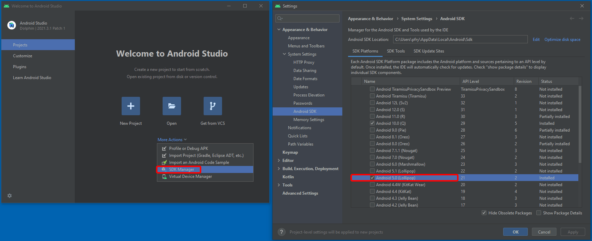
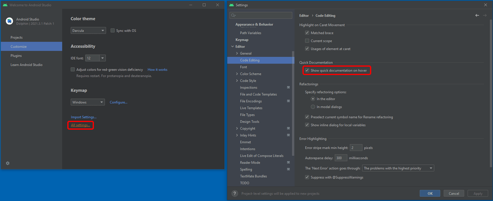

# Android Studio Setup

*Updated: 14 November 2022*

This section will focus on installing the Android Studio Integrated Development Environment (IDE) and ensuring it is prepared for ATAK plugin development.

## Install Android Studio

Follow the guide provided by the official documents [https://developer.android.com/studio/install](https://developer.android.com/studio/install) for your operating system using the default choices. Below are operating system requirements for the current most stable version of *Android Studio Dolphin | 2021.3.1* at the time of writing. The figures in this documentation will showcase this version of Android Studio; however utilizing the latest version is recommended and changes to the IDE should not be significant.

System Requirements:

- 8 GB RAM or more
- 8 GB of available disk space minimum (IDE + Android SDK + Android Emulator)
- 1280 x 800 minimum screen resolution
- Windows Specific:
  - 64-bit Microsoft® Windows® 8/10
  - x86_64 CPU architecture; 2nd generation Intel Core or newer, or AMD CPU with support for a Windows [Hypervisor.Framework](https://developer.android.com/studio/run/emulator-acceleration#vm-windows)
- Linux Specific:
  - Any 64-bit Linux distribution that supports Gnome, KDE, or Unity DE; GNU C Library (glibc) 2.31 or later.
  - x86_64 CPU architecture; 2nd generation Intel Core or newer, or AMD processor with support for AMD Virtualization (AMD-V) and SSSE3

Other operating system requirements can be found [towards the bottom of the linked page](https://developer.android.com/studio).

## Setup for ATAK Development

1. Install Android SDK 21. *Since ATAK requires a minimum version of Android 5.0 / API level 21 / Lollipop.*

   On the home *Projects* page, select *More Actions* dropdown and select *SDK Manager* to open the settings dialog. 
   On the new dialog `Appearance & Behavior > System Settings > Android SDK` page, select *Android 5.0 (Lollipop) API Level 21* then click *Apply* to download.

   

2. Quick Documentation on Mouse Hover. *As a convenience functionality of the Android Studio IDE enabling this feature will allow you to hover your mouse cursor over function calls, constants or object instances to display a tooltip showing the Java Documentation for the code item.*
   On the home *Customize* page, select "All settings..." to open the settings dialog.
   On the new dialog `Editor > Code Editing` page, ensure the "Show quick documentation on hover" option is selected under the *Quick Documentation* section then click *Apply* if necessary.

   

## Getting Familiar with Android Studio

If this is your first time using Android Studio or an IntelliJ IDE we recommend checking out the following resources in order to familiarize yourself with the terminology of the editor which will be used in later learning modules.

- [Building and Running Applications](https://developer.android.com/studio/run)
- [Project File Views](https://developer.android.com/studio/projects#ProjectFiles)
- [Layout Editor Overview](https://developer.android.com/studio/write/layout-editor)

[Go to Section 3: Android Basics](https://github.com/Toyon/LearnATAK/blob/master/doc/3_Android_Basics.md)
