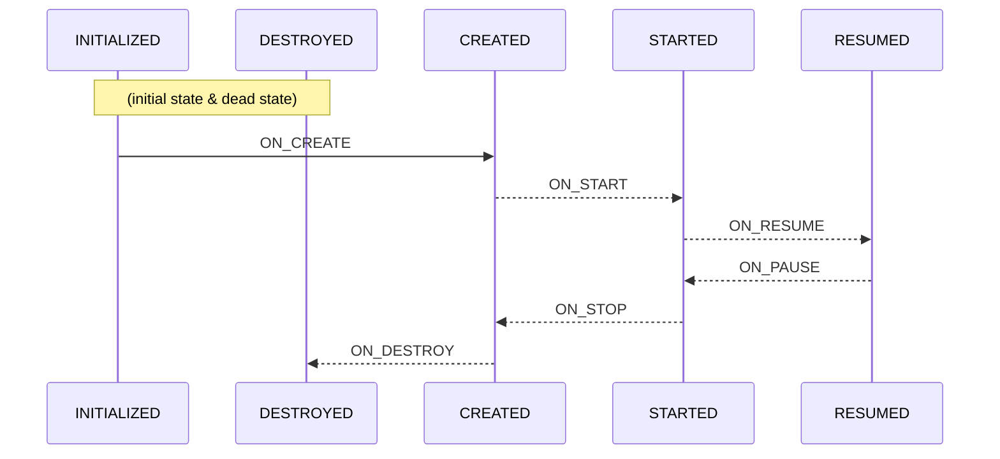

# Android Quick Start Fundamentals

*Updated 22 March 2023*

This section will introduce some common Android components and concepts that will help you quickly start understanding existing ATAK Plugins and wriiting your own. The [Android developer website docs](https://developer.android.com/docs) cover all topics discussed in this section in greater detail and will stay up to date with the latest changes; however, ATAK plugin development is not like the traditional "Build your first app" example. In this section we will try to guide you to the essential pages within the developer docs to cover to provide a foundation for a basic understanding of Android principles. 

Most of what is presented in document is derived from the [Official Android Developer Guides](https://developer.android.com/guide) and the [Official Android App Fundamentals](https://developer.android.com/guide/components/fundamentals) webpages so to explore additional topics or topics in greater detail consult the official documents as it will help you feel more confident in your understanding of the architecture of ATAK and the plugins that add functionality to the core app.

### Contents

- [Lifecycle](#Lifecycle)
- [Activities](#Activities)
- [View Models](#View-Models)
- [Fragments](#Fragments)
- [Services](#Services)

___

 

## [Lifecycle](https://developer.android.com/reference/androidx/lifecycle/Lifecycle)

The following are notable classes or components that have their own lifecycles (making them [LifecycleOwners](https://developer.android.com/reference/androidx/lifecycle/LifecycleOwner)), and are aware of changes in their lifecycle status (Lifecycle-aware): [Activities](https://developer.android.com/guide/components/activities/activity-lifecycle), [Fragments](https://developer.android.com/guide/fragments/lifecycle), [Dialogs (specifically `DialogFragment`)](https://developer.android.com/reference/androidx/fragment/app/DialogFragment#lifecycle), and [Services](https://developer.android.com/reference/android/app/Service#service-lifecycle).

<i>States and events that comprise Android Activity Lifecycle</i>

 

[TOP &#8657;](#contents)

 

## [Activities](https://developer.android.com/guide/components/activities/intro-activities)

Activities are the entry point for an application's interaction with the user. It is the single screen with a user interface presented to the user. Each Activity instance transitions through different states in their lifecycle as a user navigates to and out of an application. Properly implementing callbacks for lifecycle state changes will help avoid undesirable behaviors like your app crashing, consuming system resources when the app is not actively in use, losing user progress when returning to the app, or crashing on screen rotations. Although devices have gotten more computational power, the Android operating system still manages the systems memory and resources for optimal user experience when using an application. You don't want your application being slowed down when it is being used because another app was developed poorly. There is a lot of information to digest when it comes to these two topics if you have never learned about them in the past, but it is important to understand when it comes to your own app / plugin design decisions. [&#8657;](#contents)

 

##  [View Models ](https://developer.android.com/topic/libraries/architecture/viewmodel)

A fairly straight forward class to provide data persistence to enhance your activities by caching data through UI changes such as screen rotations.[&#8657;](#contents)

 

## [Fragments](https://developer.android.com/guide/fragments)

Another enhancement to your application user interface would be the utilization of Fragments to have multiple displays contained within a single activity. If you need a more dynamic UI with something like tab views this is an important UI element. [&#8657;](#contents)

 

## [Services](https://developer.android.com/guide/components/services)

There are a variety of different types of services, but they all essentially provide a mechanism for your application to perform long-running operations in the background as they do not provide a user interface element. They are generally more resilient to users navigating between applications as their lifecycle is determined by other factors. Understand the difference between Foreground, Background, and Bound services weighing the pros and cons of using each one. [&#8657;](#contents)

[Go to Section 4: TAK Overview](https://github.com/Toyon/LearnATAK/blob/master/doc/4_TAK_Overview.md)
