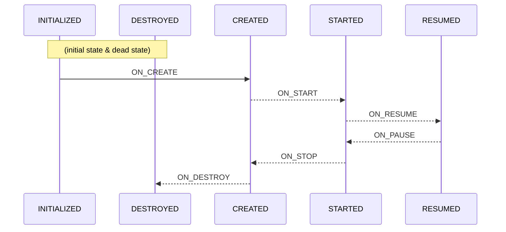
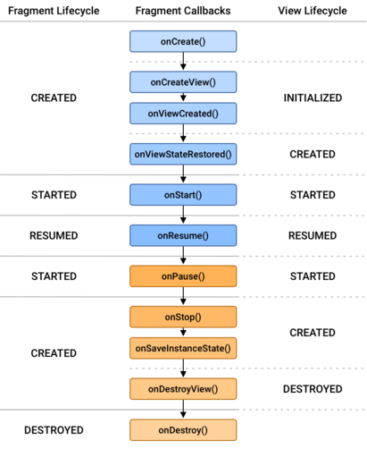

*Updated 10 August 2023*

This section will introduce common Android components and concepts that will help you understand the demo plugins and get started with creating your own plugin. The [Android developer website docs](https://developer.android.com/docs) cover all topics discussed in this section in greater detail and are maintained with the latest changes to Android. This section guides you to the pages within the developer docs that provide a foundation of Android principles needed for ATAK development. 

This document is derived from the [Official Android Developer Guides](https://developer.android.com/guide) and the [Official Android App Fundamentals](https://developer.android.com/guide/components/fundamentals) webpages. Explore these guides if you want to learn more about the Android nuts and bolts behind ATAK. 

### Contents

- [Lifecycle](#lifecycle)
- [Activities](#activities)
- [Intents](#intents)
- [ViewModels](#viewmodels)
- [Fragments](#fragments)
- [Services](#services)
  - [Foreground Services](#foreground-services)
  - [Background Services](#background-services)
  - [Bound Services](#bound-services)

___

<br>

## Lifecycle


The following are notable classes or components that have their own lifecycles (making them [LifecycleOwners](https://developer.android.com/reference/androidx/lifecycle/LifecycleOwner)), and are aware of changes in their lifecycle status (Lifecycle-aware): [Activities](https://developer.android.com/guide/components/activities/activity-lifecycle), [Fragments](https://developer.android.com/guide/fragments/lifecycle), [Dialogs (specifically `DialogFragment`)](https://developer.android.com/reference/androidx/fragment/app/DialogFragment#lifecycle), and [Services](https://developer.android.com/reference/android/app/Service#service-lifecycle). Read more about lifecycles on Android's official website [here](https://developer.android.com/reference/androidx/lifecycle/Lifecycle).

#### Android Activity Lifecycle: States and Events



 


#### Android Fragment Lifecycle: States and Events




<figure src="https://developer.android.com/guide/components/images/activity_lifecycle.png" alt="activity lifecycle official documentation" width="45%"> <figure src="https://developer.android.com/static/images/guide/fragments/fragment-view-lifecycle.png" width="45%">

[TOP &#8657;](#contents)

<br>

## Activities

Activities are the entry point for an application's interaction with the user. They provide a user interface for the plugin. Each Activity instance transitions through different states in their lifecycle as a user navigates in and out of an application. Implementing callbacks for lifecycle state changes will help avoid problems such as application crashing, overconsumption of resources, and loss of user progress when changing between apps. For example, you don't want your application being slowed down during use because another app is consuming more resources than it needs. There is a lot of to learn about Activities and Lifecycles if this is your first time working with Android, but they are essential to understand when designing your own plugin.

Almost all activities interact with the user, so the class creates a window which you can place your UI using `setContentView(View)` (defined in `res/layout` folder of the project). Within you Activity class you can define behavior for what happens when a user presses a button or enters information within the UI.

Here's the typical steps required to create an Activity that can be loaded in your Android application:

1. Define an Activity Class: In your project, create a new Java class that `extends Activity` or one of its subclasses (e.g. `LauncherActivity`). 
   
2. Create the layout resource (if needed): Create a `*.xml` file for the Activity class to load. This is not required if the Activity uses an existing layout resource defined within your project, third party library or Android standard resource.
   
3. Declare the Activity in the project's Manifest: Add the following line in the `AndroidManifest.xml`. This provides essential information to the Android system about your Activity.

   ```xml
   <activity android:name=".ACTIVITY_NAME"> </activity>
   ```
Read more about acitivities on Android's official website [here](https://developer.android.com/guide/components/activities/intro-activities).
<br>

## Intents

Intents are abstract descriptions of an operation to perform. They can be used to start activities, send information to [`BroadcastReceiver`](https://developer.android.com/reference/android/content/BroadcastReceiver) components, and communicate with a background [`Service`](#services). Within the ATAK plugin ecosystem they are the key object behind launching a plugin's UI panel. Intent objects can also pass variables if the receiving components need to operate on user string inputs, raw photo data, or other objects. Below are steps that you should follow to define a new `DropDownReceiver` within your plugin:

1. Define a unique Action string: Create a `public static final String` at the beginning of the `DropDownReceiver` class which is globally unique. Using the package name of your plugin ensures the uniqueness of the string you define. An Intent sent with this string value for the action will trigger the `DropDownReceiver`'s pane to pop up.
   
    ```java
   public static final String SAMPLE_ACTION = "com.atakmap.android.plugintemplate.PluginTemplateDropDownReceiver.SAMPLE_ACTION";
   ```

2. Define handler logic in `onReceive`: Write the necessary code within your `DropDownReceiver`class to process the intent for the action and display the plugin pane. You could also have multiple actions if the receiver is designed to simply process data.
    ```java
   public void onReceive(Context context, Intent intent) {
        if(intent.getAction().equals(SAMPLE_ACTION)){
            //TODO: showDropDown()
        }
    }
   ```
   
3. Register the receiver in the plugin `MapComponent`: The following registers the `DropDownReceiver` when the plugin is loaded in ATAK. It is necessary to register your receiver if you want your handler to operate on intents.
   
    ```java
    SampleDropDown sampleDropDown = new SampleDropDown(lView, pluginCtx);
    DocumentedIntentFilter filter = new DocumentedIntentFilter();
    filter.addAction(SampleDropDown.SAMPLE_ACTION);
    this.registerDropDownReceiver(sampleDropDown, sampleFilter);
    ```

Now you can create and send an intent to trigger this `DropDownReceiver` with:

```java
    Intent intent = new Intent();
    intent.setAction(SampleDropDown.SAMPLE_ACTION);
    intent.putExtra("data", "Nothing to see here, move along.");
    sendBroadcast(intent);
```

Read more about intents on Android's official website [here](https://developer.android.com/guide/components/intents-filters).
<br>

##  ViewModels

ViewModels provide data persistence in a Lifecycle-conscious way. Using a plain class to hold data displayed on a UI destroys the data upon switching activities, unless it's sent through intent to the next activity or stored using the saved instance state. With ViewModels, the data is cached and persists through configuration changes. This means that your UI doesn’t have to fetch data every time activities are switched or the UI configuration changes. If you are working with a lot of data that needs to be accessed by several different activities, you should use ViewModels. 

ViewModels can be used with Android's Room persistence library to communicate between the UI and a Repository that acts as an API to the database. [Here](../../atak_development/room_database_with_atak/#view-model) is an example of how to implement and use a View Model class in ATAK. 

Read more about ViewModels on Android's official website [here](https://developer.android.com/topic/libraries/architecture/viewmodel).
<br>

## Fragments

Fragments allow you to have multiple pages contained within a single activity. If you need a dynamic UI with tabs, a swipe view, or a navigation bar, use Fragments. Check out the document [here](../fragments/) for a tutorial. 


Read more about fragments on Android's official website [here](https://developer.android.com/guide/fragments).
<br>

## Services

Services allow your application to perform long-running operations in the background. They do not provide a user interface element and are more resilient to changes from navigating between applications. Some examples of service actions are handling network transactions, playing music, performing file I/O, or interacting with a content provider. Another example of a service is a [GPS tracker](https://github.com/Toyon/LearnATAK/tree/master/PlantClassifier/app/src/main/java/com/atakmap/android/plantclassifier/GPSTracker.java). You can create a GPS class that gets a location in the background without any UI input. 

This section covers Foreground, Background, and Bound services. 

### Foreground Services 

Foreground services perform an operation that is noticeable to a user, like playing music. These services `must` display a Notification that cannot be dismissed to let the user know that the service is running. Think of how Spotify/Apple music shows a notification of what song you're listening to. Foreground services can continue running when the user isn't interacting with the app. Click [here](https://developer.android.com/guide/components/foreground-services) to learn more about setting up foreground services.

### Background Services 

Background services perform operations that aren't directly noticed by a user, such as using a service to compact an app's storage or tracking GPS location.

### Bound Services 

Bound services "bind" app components to themselves by calling `bindService()`. This service provides a client-server interface that can allow components to interact with the service, send requests, and receive results. This service is destroyed when all components unbind from it. Click [here](https://developer.android.com/guide/components/bound-services) to read more about Bound Services. 

Demo-hello-world provides a good [tutorial](../example_plugins/demo-hello-world/core_components/#breakdown-service) for setting up and creating your own service. 

Read more about services on Android's official website [here](https://developer.android.com/guide/components/services).
