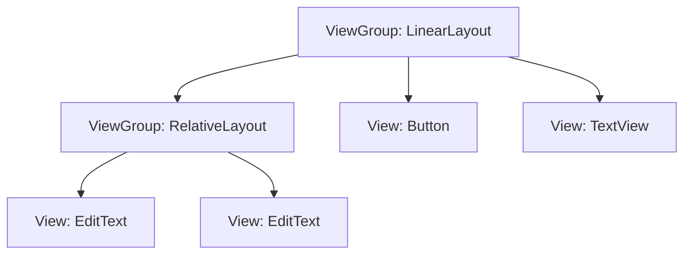
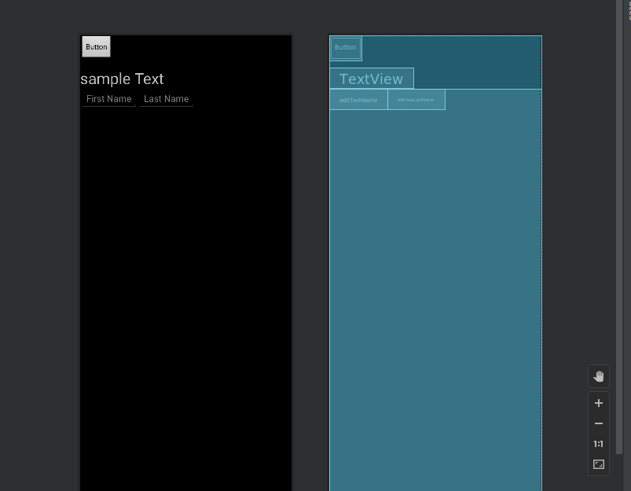
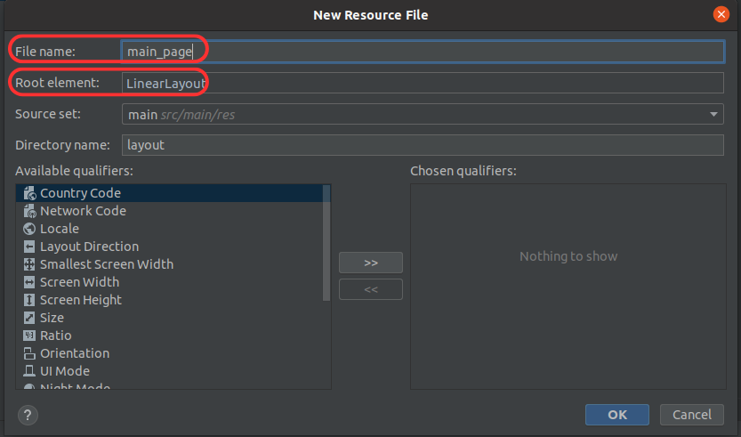
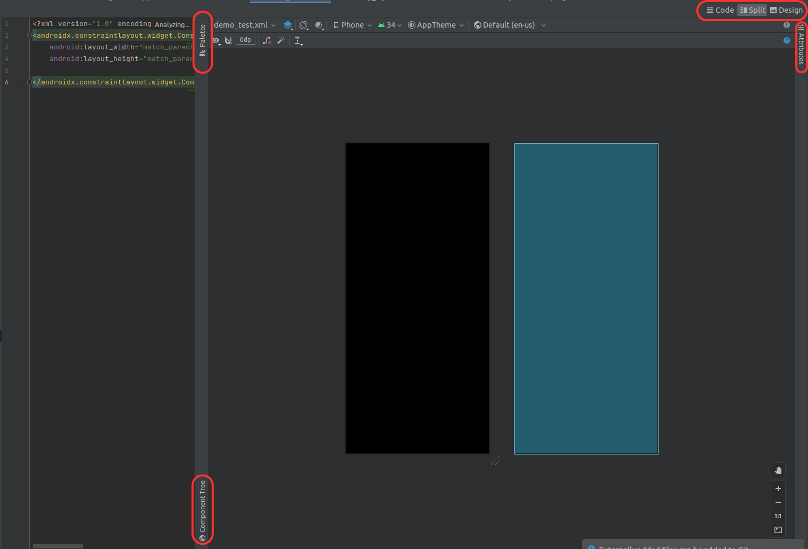
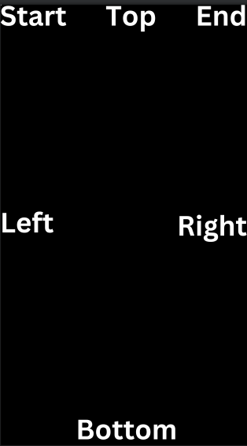
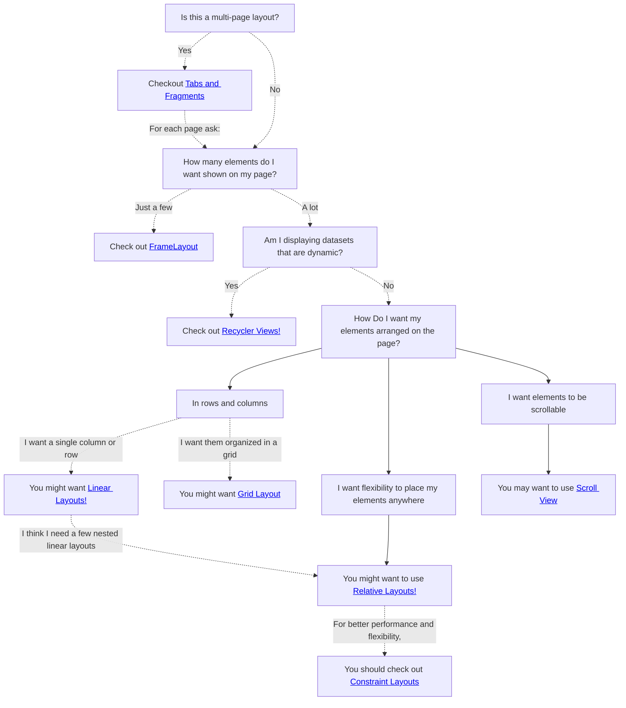
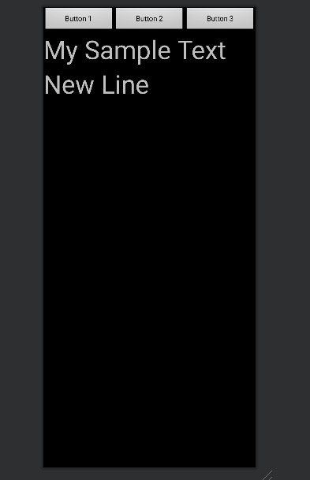

Creating your first UI can be challenging because there are many kinds of attributes, Views, and ViewGroups available.
This tutorial provides an introduction to creating your first UI layout.

Table of Contents
- [Background on XML Files](#background-on-xml-files)
- [Initial Steps](#initial-steps)
- [Choosing a View Group](#choosing-a-view-group)
    - [Weights](#weights)
- [UI and DropDownReceivers](#ui-and-dropdownreceivers)
  - [Displaying UIs](#displaying-uis)
- [Overview](#overview)
    

## Background on XML Files 

XML stands for Extensible Markup Language and is similar to HTML. In xml files, your elements are arranged in a hierarchy, which means that elements can contain other elements. The topmost element is called the "root" element and the elements it contains are called "child" elements. 

Android UIs are defined using a hierarchy of View and ViewGroup objects. Think of a ViewGroup as an invisible container that organizes child elements. Each ViewGroup performs different roles and organizes its child elements differently. Views can refer to buttons, images, texts, and widgets that are displayed in a ViewGroup. `elements` refers to ViewGroups and Views. 



The above diagram shows a top-level ViewGroup of type Linear Layout that contains two views, and another ViewGroup of type RelativeLayout that contains two other views.  
The UI design and xml file for this diagram looks like this:




```xml                                                                                                   
<?xml version="1.0" encoding="utf-8"?>
<android.widget.LinearLayout xmlns:android="http://schemas.android.com/apk/res/android"
    android:orientation="vertical" android:layout_width="match_parent"
    android:layout_height="match_parent">

    <Button
        android:id="@+id/buton1"
        android:layout_width="wrap_content"
        android:layout_height="wrap_content"
        android:text="Button"/>

    <TextView
        android:id="@+id/textView1"
        android:layout_width="wrap_content"
        android:layout_height="wrap_content"
        android:text="sample Text"
        android:layout_marginTop="15dp"
        android:textSize="30dp"/>

    <RelativeLayout
        android:layout_width="match_parent"
        android:layout_height="match_parent">

        <android.widget.EditText
            android:id="@+id/editTextName"
            android:layout_width="wrap_content"
            android:layout_height="wrap_content"
            android:hint="First Name"
            />

        <android.widget.EditText
            android:id="@+id/editTextLastName"
            android:layout_width="wrap_content"
            android:layout_height="wrap_content"
            android:layout_toRightOf="@id/editTextName"
            android:hint="Last Name"/>

    </RelativeLayout>
</android.widget.LinearLayout>
```

In the code above each pair of `<></>` act similar to java brackets, in that everything in between is contained in a single View/ViewGroup. There are two EditText elements contained inside `<RelativeLayout></RelativeLayout>`, which means those elements follow RelativeLayout's functionalities. In contrast, Button and TextView follow LinearLayouts's functionalities. Since LinearLayout has specified its `orientation` as `vertical`, the Button, TextView, and RelativeLayout are vertically stacked. In RelativeLayout, we have more freedom when placing our elements. To position elements, we use `android:layout_` parameters. For this example, we've specified the Last Name text box to the right of the First Name text box using `android:layout_toRightOf="@id/editTextName"`.  We will cover this more in depth in the [Relative Layout](#relative-layouts) section. 


## Initial Steps 

Before diving in to the different View Groups we can use, we discuss how to use Android's interface for creating UI designs. 

UI design `.xml` files belong in the `/app/res/layout/` folder. When creating a new xml file, you must: 
1. Name the file  
2. Define the root element 




For the first step, you can name the file whatever you please (`ex: main_page`) and android studio will automatically add the `.xml` for you. For defining a root element you will need to specify a ViewGroup. For now we will make our root element `LinearLayout`.

On opening the file you will see 3 buttons: `Code`, `Split`, and `Design` (on the top right). If you click on `Split` as shown below you can see the xml code alongside the UI design it produces. The `Palette` tab displays the types of elements you can add to your design separated into several categories. Underneath, the `Component Tree` shows a hierarchical layout of the elements currently in your design. Lastly, the `Attributes` tab displays the different parameters that can be applied to an element. A more detailed [description of the layout editor can be found within the official Android Studio documentation](https://developer.android.com/studio/write/layout-editor).




It's important to understand how Android defines device screen boundaries, because certain parameters like `layout_alignStart` and `layout_toEndOf` rely on these boundaries. The below image shows how this applies to Android screens, ViewGroups, and Views. 





## Choosing a View Group 

We need to choose what layout(s) we want as "containers" and as "roots" in our UI. Each layout performs different tasks. Below is a flow chart to help you decide which one is best for your use case. 
Click each layout to read more about it.  



> *NOTE* You can created nested layouts in your UI if you want your design to have sections organized differently.


1. ### Linear Layouts 

[Linear layouts](https://developer.android.com/reference/android/widget/LinearLayout) are useful if you want to display elements in a single column or row. They display elements vertically or horizontally. 
Below is sample xml code for a vertical Linear Layout that fills the size of the screen. 
By clicking `Component Tree` you should see LinearLayout when this code is added. 

```xml 
<android.widget.LinearLayout xmlns:android="http://schemas.android.com/apk/res/android"
    android:layout_width="match_parent"
    android:layout_height="match_parent"
    android:orientation="vertical">

    <!-- Include other widget or layout tags here, which are
            "child views" or "children" of the linear layout -->

</android.widget.LinearLayout>
```

LinearLayout has attributes called `android:layout_width` and `android_layout_height`. These parameters determine how much of the screen your layout will take up. `match_parent` means the width and height of the layout will match its parent's width and height. Since LinearLayout is at the root of the component tree, it will match the width and height of the android device's screen. In addition, the `android:orientation` attribute determines if the layout will be vertical or horizontal. Above it is set to `vertical`, and it can also be set to `horizontal`.  


Avoid hardcoding specific widths and heights for layouts. All Android devices have different screen sizes, and a layout that fits well on one device will be too small or big on another. We can create intricate LinearLayout designs without hardcoding widths and heights by changing the layout_width and/or layout_height attributes to equal `wrap_content` instead of `match_parent`. If we wanted a horizontal layout containing icons at the top of the screen, and a vertical layout containing text below the icons, we could do the following: 

```xml
<android.widget.LinearLayout xmlns:android="http://schemas.android.com/apk/res/android"
    android:layout_width="match_parent"
    android:layout_height="match_parent"
    android:orientation="vertical">

    <android.widget.LinearLayout
        android:layout_width="match_parent"
        android:layout_height="wrap_content"
        android:gravity="center"
        android:orientation="horizontal">
        <Button
            android:id="@+id/button"
            android:layout_width="wrap_content"
            android:layout_height="wrap_content"
            android:layout_weight="0.33"
            android:text="Button 1" />

        <Button
            android:id="@+id/button2"
            android:layout_width="wrap_content"
            android:layout_height="wrap_content"
            android:layout_weight="0.33"
            android:text="Button 2" />

        <Button
            android:id="@+id/button3"
            android:layout_width="wrap_content"
            android:layout_height="wrap_content"
            android:layout_weight="0.33"
            android:text="Button 3" />

    </android.widget.LinearLayout>

    <TextView
        android:id="@+id/textView6"
        android:layout_width="wrap_content"
        android:layout_height="wrap_content"
        android:textSize="50dp"
        android:text="My Sample Text" />

    <TextView
        android:id="@+id/textView7"
        android:layout_width="wrap_content"
        android:layout_height="wrap_content"
        android:textSize="50dp"
        android:text="New Line" />

</android.widget.LinearLayout>
```

)



By making our horizontal layout's height equal to `wrap_content`, it will wrap around our buttons and keep the rest of the screen available for the vertical column of text. Sizes for text, widths, and heights should be a string followed by `dp`, for example `layout_marginTop = "10dp"`.

#### Weights
`layout_weight` allows LinearLayout to fit any device screen size. It assigns an "importance" value (0 to 1) to a View to indicate how much space it should occupy on the screen. A larger weight value allows the View to fill the remaining space on the screen in a parent view. 

Buttons in the above code have a layout weight equal to `0.33`, so each button will fill up 1/3 of the row. Since the text elements below the buttons don't have weights specified, they don't fill up the rest of the vertical layout. 


2. ### Frame Layout

[Frame Layout](https://developer.android.com/reference/android/widget/FrameLayout) is a view group designed to reserve an area of the screen to display a single item. This layout can hold more than one item, but it's not recommended because it's hard to organize the items to avoid overlapping on smaller screen sizes. Frame Layout uses the attribute `layout_gravity` to control the positioning of child views. This attribute takes a string value (`top`,`bottom`,`left`,`right`,`start`,`end`,`center`,etc) to determine where to position the child view. You can combine two values if needed with a `"|"` separating them in the string. In the below example, the last image is placed in the bottom right of the screen using `android:layout_gravity="right|bottom"`.  This code places an image at each corner of the screen and one in the middle. 

```xml 
<?xml version="1.0" encoding="utf-8"?>
<FrameLayout xmlns:android="http://schemas.android.com/apk/res/android"
    xmlns:app="http://schemas.android.com/apk/res-auto"
    xmlns:tools="http://schemas.android.com/tools"
    android:layout_width="match_parent"
    android:layout_height="match_parent">

    <ImageView
        android:id="@+id/imageView"
        android:layout_width="100dp"
        android:layout_height="100dp"
        android:background="@drawable/my_image"
        android:layout_gravity="center"/>

    <ImageView
        android:id="@+id/imageView1"
        android:layout_width="100dp"
        android:layout_height="100dp"
        android:background="@drawable/my_image1"
        android:layout_gravity="bottom"/>
    <ImageView
        android:id="@+id/imageView2"
        android:layout_width="100dp"
        android:layout_height="100dp"
        android:background="@drawable/my_image2"
        android:layout_gravity="start"/>
    <ImageView
        android:id="@+id/imageView3"
        android:layout_width="100dp"
        android:layout_height="100dp"
        android:background="@drawable/my_image3"
        android:layout_gravity="right|end"/>
    <ImageView
        android:id="@+id/imageView4"
        android:layout_width="100dp"
        android:layout_height="100dp"
        android:background="@drawable/my_image4"
        android:layout_gravity="right|bottom"/>

</FrameLayout>
```

3. ### Grid Layout

[Grid Layout](https://developer.android.com/reference/android/widget/GridLayout) places its children in a rectangular, tabular grid. The lines separating each cell in the grid are invisible on the UI page. You don't need to specify both the amount of rows and columns in your grid and which cell, or index, the child views should be placed in. You can specify one or the other and then GridLayout will automatically assign a cell for a view based on its orientation, rowCount, and ColumnCount properties. You can declare how many rows and columns there will be in a GridLayout using the `android:rowCount` and `android:columnCount` attributes. Use `layout_row` and `layout_column` to specify where a child view should be placed. The indices for the grid start at 0 and go up to N-1, where N is the total number of rows or columns (this works the same way as indexing in an array). The attribute `layout_gravity` takes a string specifying where in the cell your view should be placed. Similar to Frame Layout, it can take the values `center`, `top`, `bottom`, `start`, `end`, `right`, and `left`. For example, to put a view in the bottom left corner of a cell, you can set `layout_gravity` = `"bottom|left"`. This attribute also works for positioning your GridLayout inside of a parent ViewGroup. In our example below, GridLayout is centered horizontally inside of a vertical LinearLayout.


```xml 
<?xml version="1.0" encoding="utf-8"?>
<android.widget.LinearLayout xmlns:android="http://schemas.android.com/apk/res/android"
    android:orientation="vertical"
    android:layout_width="match_parent"
    android:layout_height="match_parent">

    <TextView
        android:layout_width="match_parent"
        android:layout_height="wrap_content"
        android:textSize="40dp"
        android:text="My Table of Buttons" />

    <GridLayout
        android:layout_width="wrap_content"
        android:layout_height="wrap_content"
        android:layout_gravity="center">

        <Button
            android:id="@+id/button"
            android:layout_width="wrap_content"
            android:layout_height="wrap_content"
            android:layout_row = "0"
            android:layout_column="0"
            android:text="Button" />

        <Button
            android:id="@+id/button2"
            android:layout_width="wrap_content"
            android:layout_height="wrap_content"
            android:layout_row = "0"
            android:layout_column="1"
            android:text="Button" />

        <Button
            android:id="@+id/button3"
            android:layout_width="wrap_content"
            android:layout_height="wrap_content"
            android:layout_row = "1"
            android:layout_column="0"
            android:text="Button" />

        <Button
            android:id="@+id/button4"
            android:layout_width="wrap_content"
            android:layout_height="wrap_content"
            android:layout_row = "1"
            android:layout_column="1"
            android:text="Button" />

        <Button
            android:id="@+id/button5"
            android:layout_width="wrap_content"
            android:layout_height="wrap_content"
            android:layout_row = "2"
            android:layout_column="0"
            android:text="Button" />

    </GridLayout>

</android.widget.LinearLayout>
```

4. ### Scroll View 

[Scroll view](https://developer.android.com/reference/android/widget/ScrollView) is a view group that allows for scrolling within the view hierarchy it contains. Scroll view may have only one direct child placed within it. To add multiple views within the scroll view, make the direct child you add a view group and place additional views within that view group: 
```xml
<?xml version="1.0" encoding="utf-8"?>
<ScrollView xmlns:android="http://schemas.android.com/apk/res/android"
    android:layout_width="match_parent"
    android:layout_height="match_parent">

    <android.widget.LinearLayout
        android:layout_width="match_parent"
        android:layout_height="wrap_content"
        android:orientation="vertical">
 <!-- Include other widget or layout tags here. These are considered
            "child views" or "children" of the linear layout -->
        
    </android.widget.LinearLayout>
</ScrollView>
```
The LinearLayout's height is `wrap_content` since it will need to extend past the size of the screen/parent and wrap around the elements it contains.

5. ### Relative Layouts

[Relative Layouts](https://developer.android.com/develop/ui/views/layout/relative) is a view group that displays child views in positions relative to their siblings and/or to the parent view. They can eliminate nested view groups and keep your layout hierarchy flat. If you find yourself using several nested LinearLayout groups, you may be able to replace them with a single RelativeLayout.
Here are a few RelativeLayout positioning elements: 

1. `layout_alignParentTop`
Boolean. Setting this parameter to true will position the top edge of your element to the top edge of the parent. 
2. `layout_below`
This will position the top edge of your element below an element specified with a resource ID.
3. `layout_toRightOf`
This will position the left edge of your element to the right of an element specified with a resource ID.

Look at the `layout_` portion under the `Attributes` tab for a full list of parameters. 
Here is code that creates the same UI design as that in the LinearLayout code above, but this time using RelativeLayout as the root element: 
```xml
<?xml version="1.0" encoding="utf-8"?>
<RelativeLayout xmlns:android="http://schemas.android.com/apk/res/android"
    android:layout_width="match_parent"
    android:layout_height="match_parent">

    <Button
        android:id="@+id/button"
        android:layout_width="137dp"
        android:layout_height="wrap_content"
        android:layout_alignParentStart="true"
        android:layout_alignParentTop="true"
        android:text="Button 1" />

    <Button
        android:id="@+id/button2"
        android:layout_width="137dp"
        android:layout_height="wrap_content"
        android:layout_toRightOf="@id/button"
        android:text="Button 2" />

    <Button
        android:id="@+id/button3"
        android:layout_width="137dp"
        android:layout_height="wrap_content"
        android:layout_alignParentTop="true"
        android:layout_alignParentEnd="true"
        android:text="Button 3" />

    <TextView
        android:id="@+id/textView6"
        android:layout_width="wrap_content"
        android:layout_height="wrap_content"
        android:layout_below="@+id/button"
        android:text="My Sample Text"
        android:textSize="50dp" />

    <TextView
        android:id="@+id/textView7"
        android:layout_width="wrap_content"
        android:layout_height="wrap_content"
        android:layout_below="@+id/textView6"
        android:text="New Line"
        android:textSize="50dp" />

</RelativeLayout>
```

>*NOTE* `layout_weight` is a property of LinearLayout attributes and can't be applied to RelativeLayouts. If you need `layout_weight` for your elements, you should use LinearLayout as your root element.

6. ### Constraint Layouts 

[Constraint Layouts](https://developer.android.com/reference/androidx/constraintlayout/widget/ConstraintLayout) allow you to position and size widgets in specific places. It is similar to RelativeLayout. It is not included in Android's base packages so you will need to add this to your app's `build.gradle` file:

```groovy
dependencies {
	implementation ('androidx.constraintlayout:constraintlayout:2.1.4')
}
```

In a ConstraintLayout, you must use the `layout_constraint` parameters found in the `Attributes` tab for positioning. You can constrain an element to a sibling element and/or to a parent one. You can also constrain to the left, right, start, end, top, or bottom of any other element. Make sure you have two constraints on each element: one vertical constraint (top, bottom) and one horizontal constraint(left,right,start,end).

In [demo-hello-world's](../../example_plugins/demo-hello-world/layouts/#relative-layout-vs-constraint-layout) Layout's document, there is a handy table that gives parameters to create the same positioning across a parent Relative or Constraint Layout.
Here is code using ConstraintLayout as the parent ViewGroup. This creates the same positioning as the code from the Relative Layout section:

```xml
<?xml version="1.0" encoding="utf-8"?>
<androidx.constraintlayout.widget.ConstraintLayout xmlns:android="http://schemas.android.com/apk/res/android"
    xmlns:app="http://schemas.android.com/apk/res-auto"
    xmlns:tools="http://schemas.android.com/tools"
    android:layout_width="match_parent"
    android:layout_height="match_parent">

    <Button
        android:id="@+id/button"
        android:layout_width="137dp"
        android:layout_height="wrap_content"
        android:text="Button 1"
        app:layout_constraintEnd_toStartOf="@+id/button2"
        app:layout_constraintTop_toTopOf="parent" />

    <Button
        android:id="@+id/button2"
        android:layout_width="137dp"
        android:layout_height="wrap_content"
        android:text="Button 2"
        app:layout_constraintStart_toEndOf="@+id/button"
        app:layout_constraintTop_toTopOf="parent" />

    <Button
        android:id="@+id/button3"
        android:layout_width="137dp"
        android:layout_height="wrap_content"
        android:text="Button 3"
        app:layout_constraintStart_toEndOf="@+id/button2"
        app:layout_constraintTop_toTopOf="parent" />

    <TextView
        android:id="@+id/textView6"
        android:layout_width="wrap_content"
        android:layout_height="wrap_content"
        android:text="My Sample Text"
        android:textSize="50dp"
        app:layout_constraintStart_toStartOf="parent"
        app:layout_constraintTop_toBottomOf="@+id/button" />

    <TextView
        android:id="@+id/textView7"
        android:layout_width="wrap_content"
        android:layout_height="wrap_content"
        android:text="New Line"
        android:textSize="50dp"
        app:layout_constraintStart_toStartOf="parent"
        app:layout_constraintTop_toBottomOf="@+id/textView6" />

</androidx.constraintlayout.widget.ConstraintLayout>
```

Instead of using `layout_alignParentStart` and `layout_toRightOf` for buttons, we use `app:layout_constraintTop_toTopOf` and `app:layout_constraintStart_toEndOf`. There are no "Parent" specific constraints in this case, unlike how RelativeLayout uses alignParentStart. Instead, if you want to constrain an element to a parent element, you would set the parameter to `parent` as seen above.  


7. ### Recycler View

The last layout we will cover is [Recycler views](https://developer.android.com/reference/androidx/recyclerview/widget/RecyclerView). Recycler views are important if you want to add dynamic data to a UI page. For example, in [DemoCNN](https://github.com/Toyon/LearnATAK/tree/master/democnn/app/src/main/res/layout/pane_main.xml#L8-L16) and [demo-plant-classifier](https://github.com/Toyon/LearnATAK/tree/master/demo-plant-classifier/app/src/main/res/layout/main_layout.xml#L61-L70), the main page layouts use recycler views in order to display the objects captured. To display dynamic data in this view, you can create an adapter class to signal inserts, moves, and deletions. 

Your adapter class must contain and override these 3 methods: 
1. `onCreateViewHolder(ViewGroup group, int viewType)` 
    Called by recycler view whenever it needs to create a new ViewHolder. 
2. `onBindViewHolder(ViewHolder viewHolder, final int position)`
    Fetches the appropriate data and fills in the ViewHolder's layout. 
3. `getItemCount()` 
    Gets the size of the dataset to determine how many items will be bound to the ViewHolder. 

You also need two xml files in order to display data in a recycler view. The first xml file will be the page containing the RecyclerView(in our example it is `main_page.xml`) and the second file will lay out the design you want for each item in your dataset (`my_data_layout.xml`). 

In the below example Adapter class, the recyclerView contains a simple TextView for each item in the dataset. In the function `onCreateViewHolder`, we set the view to be the data layout xml `my_data_layout`. In the static class `ViewHolder`, we take all of the elements in our data layout and assign them to member variables. In the example we modify only one TextView. Lastly, `onBindViewHolder` will set the member variable associated with the TextView to the new text received from the dataset. 

Here is our adapter class: 

```java
public class CustomAdapter extends RecyclerView.Adapter<CustomAdapter.ViewHolder> {

    private String[] localDataSet;
    /**
     * Provide a reference to the type of views that you are using
     * (custom ViewHolder)
     */
    public static class ViewHolder extends RecyclerView.ViewHolder {
        private final TextView textView;

        public ViewHolder(View view) {
            super(view);
            // Define click listener for the ViewHolder's View

            textView = (TextView) view.findViewById(R.id.myTextView);
        }
        public TextView getTextView() {
            return textView;
        }
    }
    /**
     * Initialize the dataset of the Adapter
     *
     * @param dataSet String[] containing the data to populate views to be used
     * by RecyclerView
     */
    public CustomAdapter(String[] dataSet) {
        localDataSet = dataSet;
    }
    // Create new views (invoked by the layout manager)
    @Override
    public ViewHolder onCreateViewHolder(ViewGroup viewGroup, int viewType) {
        // Create a new view, which defines the UI of the list item
        View view = LayoutInflater.from(viewGroup.getContext())
                .inflate(R.layout.my_data_layout, viewGroup, false);

        return new ViewHolder(view);
    }
    // Replace the contents of a view (invoked by the layout manager)
    @Override
    public void onBindViewHolder(ViewHolder viewHolder, final int position) {

        // Get element from your dataset at this position and replace the
        // contents of the view with that element
        viewHolder.getTextView().setText(localDataSet[position]);
    }
    // Return the size of your dataset (invoked by the layout manager)
    @Override
    public int getItemCount() {
        return localDataSet.length;
    }
}
```

The below xml file `my_data_layout.xml` creates the UI design for each object placed in the recycler view:

```xml
<?xml version="1.0" encoding="utf-8"?>
<androidx.constraintlayout.widget.ConstraintLayout xmlns:android="http://schemas.android.com/apk/res/android"
    xmlns:app="http://schemas.android.com/apk/res-auto"
    xmlns:tools="http://schemas.android.com/tools"
    android:layout_width="match_parent"
    android:layout_height="wrap_content">

    <TextView
        android:id="@+id/myTitle"
        android:layout_width="wrap_content"
        android:layout_height="wrap_content"
        android:textSize="20sp"
        app:layout_constraintStart_toStartOf="parent"
        app:layout_constraintTop_toTopOf="parent"
        tools:text="Here is my text" />

    <TextView
        android:id="@+id/myTextView"
        android:layout_width="wrap_content"
        android:layout_height="wrap_content"
        android:textSize="20sp"
        app:layout_constraintStart_toStartOf="parent"
        app:layout_constraintTop_toBottomOf="@+id/myTitle"
        tools:text="Sample Text" />

</androidx.constraintlayout.widget.ConstraintLayout>
```

The below `main_page.xml` contains the Recycler View:

```xml
<?xml version="1.0" encoding="utf-8"?>
<androidx.constraintlayout.widget.ConstraintLayout xmlns:android="http://schemas.android.com/apk/res/android"
    xmlns:app="http://schemas.android.com/apk/res-auto"
    xmlns:tools="http://schemas.android.com/tools"
    android:layout_width="match_parent"
    android:layout_height="match_parent">

    <TextView
        android:id="@+id/main_title_txt"
        android:layout_width="wrap_content"
        android:layout_height="wrap_content"
        android:text="My Home Page"
        android:textSize="24sp"
        app:layout_constraintStart_toStartOf="parent"
        app:layout_constraintTop_toTopOf="parent" />


    <androidx.recyclerview.widget.RecyclerView
        android:id="@+id/my_list"
        android:layout_width="match_parent"
        android:layout_height="wrap_content"
        app:layout_constraintTop_toBottomOf="@id/main_title_txt"
        app:layout_constraintLeft_toLeftOf="parent"/>

</androidx.constraintlayout.widget.ConstraintLayout>
```

To use the Adapter class, we do not need to directly call any of the methods used above because they are invoked by the layout manager. To initiate updates to the view, we have a method in the class called `update(String[] newData)` that takes in an updated array of new data, and assigns it to the member variable `localDataSet`: 

```java
public static void update(String[] newData){
    localDataSet = newData; 
}
```

Then layout manager invokes the rest of the functions and updates the UI view. We can call `update()` in an Activity or DropDownReceiver when we insert, change, or remove an object from our dataset. 

Lastly, we will need to `set` our RecyclerView to the adapter so that the adapter knows which ViewGroup to update with the data designs. In an Activity or DropDownReceiver, we do that by: 

```java
View paneView = PluginLayoutInflater.inflate(pluginContext, R.layout.main_page, null);
RecyclerView ourList = paneView.findViewById(R.id.my_list);
ourList.setLayoutManager(new LinearLayoutManager(paneView.getContext(), LinearLayoutManager.VERTICAL, false));
CustomAdapter customAdapter = new CustomAdapter(String[] emptyList); 
ourList.setAdapter(customAdapter);
```

Now we can call update on our customAdapter object and our UI will reflect the database changes!

If you want more complex examples checkout the [AnimalAdapter](https://github.com/Toyon/LearnATAK/tree/master/democnn/app/src/main/java/com/toyon/demo-cnn/adapters/Animal.java) from DemoCNN which uses a refresher function in its MainDropDown to collect animal markers from ATAK's map, and the nested adapters: [PlantsAdapter](https://github.com/Toyon/LearnATAK/tree/master/demo-plant-classifier/app/src/main/java/com/toyon/plantclassifier/adapters/PlantsAdapter.java) and [PlantCategoryAdapter](https://github.com/Toyon/LearnATAK/tree/master/demo-plant-classifier/app/src/main/java/com/toyon/plantclassifier/adapters/PlantCategoryAdapter.java) from demo-plant-classifier which utilizes LiveData, Room Database, and Nested Recycler Views. 


## UI and DropDownReceivers

You can use the attribute `android:id` in your xml files in order to access Image and Text in other classes. 
For example: Say you had an xml file called: `home_page.xml` that looked like this: 

```xml 
<?xml version="1.0" encoding="utf-8"?>
<android.widget.LinearLayout xmlns:android="http://schemas.android.com/apk/res/android"
    xmlns:app="http://schemas.android.com/apk/res-auto"
    xmlns:tools="http://schemas.android.com/tools"
    android:layout_width="match_parent"
    android:layout_height="match_parent"
    android:orientation="vertical">

    <android.widget.LinearLayout
        android:layout_width="match_parent"
        android:layout_height="wrap_content"
        android:gravity="center"
        android:orientation="horizontal">

        <Button
            android:id="@+id/myButton"
            android:layout_width="148dp"
            android:layout_height="199dp"
            android:layout_margin="4dp"
            android:backgroundTint="@color/white"
            tools:ignore="TouchTargetSizeCheck,SpeakableTextPresentCheck" />

        <ImageView
            android:id="@+id/imageView1"
            android:layout_width="93dp"
            android:layout_height="match_parent"
            android:layout_weight="1"
            tools:src="@tools:sample/backgrounds/scenic" />

        <TextView
            android:id="@+id/textView1"
            android:layout_width="wrap_content"
            android:layout_height="wrap_content"
            android:layout_weight="1"
            android:text="Sample Text" />


    </android.widget.LinearLayout>

</android.widget.LinearLayout>
```

### Displaying UIs
To display your `home_view` with DropDownReceivers, include this line in your constructor. `paneView` is a member variable of the class and the parameter `context` is the plugin context passed through your DropDownReceiver's constructor: 

```java 
View paneView = PluginLayoutInflater.inflate(context, R.layout.home_page, null); 
```

Then in the `function` onReceive you would call `showDropDown`. You can modify the landscape and portrait dimensions to match your preferences. 

```java
showDropDown(paneView,
                    THREE_EIGHTHS_WIDTH, FULL_HEIGHT, // Landscape Dimensions
                    FULL_WIDTH, THREE_EIGHTHS_HEIGHT, // Portrait Dimensions
                    false, this);
```

## Overview

Now that we know how to create UI layouts, let's cover the elements we can add inside these layouts in the UI Widgets Tutorial. 
