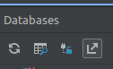

The Room persistence library provides an abstraction layer over a local SQLite database to allow you to work with structured data organized in tables. The Plant Classifier's [`database`](https://github.com/Toyon/LearnATAK/-/tree/main/demo-plant-classifier/app/src/main/java/com/toyon/plantclassifier/database) package has examples of the 5 classes used to create and access a local database on the Android device. The last section, `Accessing`, shows how to access and use the database in ATAK.  

- [Requirements](#requirements)
- [Entities](#entities)
- [Data Access Objects](#data-access-objects)
- [Database](#database)
- [Repository](#repository)
- [View Model](#view-model)
- [Querying the Database](#querying-the-database)
  - [Using LiveData](#using-livedata)
  - [Using an ArrayList()](#using-an-arraylist)
- [Accessing](#accessing)


The first 3 classes are mandatory and the other two make accessing the database much easier.

## Requirements 

Before we dive into the tutorial, here are the requirements you must include in your app's build.gradle file in order for your plugin to build properly.

```groovy
 def room_version = "2.5.2"
 implementation "androidx.room:room-ktx:2.5.2"
 implementation "androidx.room:room-runtime:$room_version"
 annotationProcessor "androidx.room:room-compiler:$room_version"
 testImplementation "androidx.room:room-testing:$room_version"
 implementation "androidx.room:room-paging:$room_version"
 implementation 'androidx.lifecycle:lifecycle-extensions:2.2.0'
```

<br>

## Entities

First define an [Entity](https://developer.android.com/reference/androidx/room/Entity?hl=en) class that will provide a mapping to a SQLite table in the database.
It must be a basic class marked with the `@Entity` [annotaion](https://docs.oracle.com/javase/tutorial/java/annotations/basics.html) which can also specify the desired name of your table. Each member variable name corresponds to a column in the table (unless annotated with  `@Ignore`). One of the fields must be annotated with `@PrimaryKey`. A constructor without arguments or with parameters matching fields is also required. For more details about the requirements and features read [the docs](https://developer.android.com/reference/androidx/room/Entity?hl=en).
Example:

```java
@Entity(tableName = "plants")
public class PlantEntity {
    @PrimaryKey(autoGenerate = true)
    public int id;
    public String plantType;
    public String commonName;
    public String edible;
    public String certainty;
    public byte[] image;
    public String location;
    public String notes;
    public String uid;

    public PlantEntity(String plantType, String commonName, byte[] image, String certainty,
                       String edible, String notes, String location, String uid) {
        this.plantType = plantType;
        this.image = image;
        this.certainty = certainty;
        this.commonName = commonName;
        this.edible = edible;
        this.notes = notes;
        this.location = location;
        this.uid = uid;
    }
}
```

## Data Access Objects

Next define a [Data Access Object (DAO)](https://developer.android.com/reference/androidx/room/Dao?hl=en) which allows you to map Java functions to query methods.
It must be an interface (or abstract class) marked with the `@DAO` annotation. It is recommended to to have at least one `Dao` class for each `Entity` class. The example below shows fundamental CRUD (Create, read, update, delete) operations with corresponding shorthand annotations:
`@Insert`, `@Query("SELECT * FROM <TABLE>")`, `@Update`, `@Delete`
Returning `LiveData` from your queries leverages the Room library to generate all the necessary code to update the `LiveData` if the result of that query is impacted by a database modification. Additionally, since `LiveData` is an observable data holder class that is lifecycle aware, it makes updating UI elements simpler and only updates app components observers who are active. For more details about requirements and features of DAOs read [the docs](https://developer.android.com/reference/androidx/room/Dao?hl=en).
Example:

```java
@Dao
public interface PlantsDao {

    @Insert
    void insert(PlantEntity plant);
    @Update
    void update(PlantEntity plant);
    @Delete
    void delete(PlantEntity plantEntity);
    @Query("SELECT * FROM plants")
    LiveData<List<PlantEntity>> getPlantsList();
}
```

## Database

Next define a [Room Database](https://developer.android.com/reference/androidx/room/Database?hl=en) class which builds your database and is the key entry point to access the database. 
It must be an abstract class marked with the `@Database` annotation. This is used to define tables with `Entity` objects, the database version number, and whether the database schema should be exported to a folder. The example below defines 1 table, 1 DAO class, and sample abstract methods to access the database. For more details about requirements and features read [the docs](https://developer.android.com/reference/androidx/room/Database?hl=en).
Example: 

```java
@Database(entities = {PlantEntity.class}, version = 1, exportSchema = false)
public abstract class PlantsDatabase extends RoomDatabase {

    private static volatile PlantsDatabase instance;

    public abstract PlantsDao Dao();

    private static final int NUMBER_OF_THREADS = 4;
    static final ExecutorService databaseWriteExecutor = Executors.newFixedThreadPool(NUMBER_OF_THREADS);

    static PlantsDatabase getDatabase(final Context context) {
        if (instance == null) {
            synchronized (PlantsDatabase.class) {
                if (instance == null) {
                    instance = Room.databaseBuilder(context.getApplicationContext(),
                                    PlantsDatabase.class, "plants_database")
                            .addCallback(sRoomDatabaseCallback)
                            .build();
                }
            }
        }
        return instance;
    }

    private static RoomDatabase.Callback sRoomDatabaseCallback = new RoomDatabase.Callback() {
        @Override
        public void onCreate(@NonNull SupportSQLiteDatabase db) {
            super.onCreate(db);
        }
    };
```


## Repository

Next we define a basic `Repository` class to provide abstract access to multiple data sources.
This is not required to interact with the room database, but it provides a clean wrapper to reduce some boilerplate code when working with the `RoomDatabase` object. It also standardizes the required application resources, so you can use it wherever you need within your plugin. The class also manages queries and allows you to use multiple backends. The example below creates an instance of the database, and then has 4 functions that correspond to those defined earlier in the DAO.
Example:

```java
public class PlantsRepository {

    private final PlantsDao dao;
    private final LiveData<List<PlantEntity>> allPlants;

    public PlantsRepository(Application application){
        PlantsDatabase database = PlantsDatabase.getDatabase(application);
        dao = database.Dao();
        allPlants = dao.getPlantsList();
    }

    public void insert(PlantEntity plant){
        PlantsDatabase.databaseWriteExecutor.execute(() -> {
            dao.insert(plant);
        });
    }
    public void update(PlantEntity plant) {
        PlantsDatabase.databaseWriteExecutor.execute(() -> {
            dao.update(plant);
        });
    }
    public void delete(PlantEntity plant) {
        PlantsDatabase.databaseWriteExecutor.execute(()-> {
            dao.delete(plant);
        });
    }
    // below method is to read all the courses.
    LiveData<List<PlantEntity>> getAllPlants(){
        return allPlants;
    }
}
```

## View Model

The last class to define is [`ViewModel`](https://developer.android.com/topic/libraries/architecture/viewmodel.html), which provides data to the UI and persists through configuration changes.
This extends the `AndroidViewModel` class, which is used to preserve data in memory through screen rotations. This class acts as the bridge between the previously defined `Reposiory` and the UI. Read more about `ViewModel` [here](https://developer.android.com/topic/libraries/architecture/viewmodel.html). 
Example:

```java
public class PlantsViewModel extends AndroidViewModel {
    private final PlantsRepository repository;
    private final LiveData<List<PlantEntity>> allPlants;

    public PlantsViewModel(@NonNull Application application) {
        super(application);
        repository = new PlantsRepository(application);
        allPlants = repository.getAllPlants();
    }
    public LiveData<List<PlantEntity>> getAllPlants() { return allPlants; }


    public void insert(PlantEntity plantEntity) {
        repository.insert(plantEntity);
    }

    public void update(PlantEntity plantEntity) {
        repository.update(plantEntity);
    }

    public void delete(PlantEntity plantEntity) {
        repository.delete(plantEntity);
    }

}
```

## Querying the Database 

There are many ways to query your tables in Room's persistent library. 

### Using LiveData

In the example above, we used [LiveData](https://developer.android.com/topic/libraries/architecture/livedata) to get all the data stored in our table. LiveData is an observable data holder class that allows you to `observe` the data in your table, so it can automatically run code or update the UI whenever a change is made to the database. This is a great tool for when you want entries in a RecyclerView to automatically update. In order to use LiveData follow the steps below.

1. First, we must create an instance of LiveData that corresponds to one of our queries. In our [DAO](#data-access-objects) interface, our Query `SELECT * FROM plants` is connected to the method `getPlantsList()` that returns the type LiveData<List<PlantEntity>> 

2. We need to create an Observer object that is connected to our LiveData<List<PlantEntity>>, and will listen for changes and update the UI accordingly: 

    ```java
      private Observer<List<MyEntity>> handleDatabaseChange = new Observer<List<MyEntity>>() {
        @Override
        public void onChanged(List<MyEntity> newEntities) {
            int currentSize = localDataSet.size();
            localDataSet.clear();
            notifyDataSetChanged();
            localDataSet.addAll( newEntities);
            new Handler(Looper.getMainLooper()).post(new Runnable(){
                @SuppressLint(("NotifyDataSetChanged"))
                @Override
                public void run() {
                    notifyDataSetChanged();
                }
            });
        }
    };
    ```
    Our localDataSet, connected to a RecyclerView, gets the newEntities added when the Observer object dectects a change in the database. Updating localDataSet will update the data that's displayed in the UI. 

### Using an ArrayList()

Say we want a List of all entries so we could iterate over the entries without needing to observe changes in the database. We can create a new Query function in our `DAO` interface and use the database's `ExecutorService` to make sure we run the query on a separate thread than the main plugin UI thread. 

In our DAO interface we define our query to return a list of entities:

```java
    @Query("SELECT * FROM our_table")
    List<OurEntity> getListEntities();
```

Then in our repository we use the `ExecutorService` called `databaseWriteExecutor` to submit a new Callable that returns a list of entities. We will have to override the `call()` function to return dao.getListEntities(). To get the actual list and return it to the view model we call `get()` on our `databaseWriteExecutor`. 

```java
    public List<OurEntity> getListEntities() throws ExecutionException, InterruptedException {

        List<OurEntity> ourEntities = OurDatabase
                .databaseWriteExecutor.submit(new Callable<List<OurEntity>>() {
                    @Override
                    public List<OurEntity> call()  {
                        return dao.getListEntities();
                    }
                }).get();
        return ourEntities;
    }
```

In our ViewModel we can call this function to access the list of our table's contents. Make sure each function that uses `getListEntities()` from your ViewModel throws `ExecutionException, InterruptedException` and is wrapped in a try{}catch{} block in case any errors arise. 


## Accessing 

Accessing the database in ATAK is straightforward and only requires a few changes compared to standard Android use.
For each UI element that depends on the local database, you will need to create an [instance](https://github.com/Toyon/LearnATAK/tree/master/demo-plant-classifier/app/src/main/java/com/toyon/plantclassifier/MainDropDown.java#L70) of your `ViewModel` class as below: 

```java
PlantsViewModel viewPlants = new ViewModelProvider(ViewTreeViewModelStoreOwner.get(getMapView())).get(PlantsViewModel.class); 
```
A common point of confusion is how to get the `ViewModelStoreOwner` parameter required for the [`ViewModelProvider`](https://developer.android.com/reference/androidx/lifecycle/ViewModelProvider#ViewModelProvider(androidx.lifecycle.ViewModelStoreOwner)). We can retrieve this value using the ATAK `MapView` and the [`ViewTreeModelStoreOwner.get()`](https://developer.android.com/reference/androidx/lifecycle/ViewTreeViewModelStoreOwner#(android.view.View).get()) function. Now we can use defined wrapper functions in the `ViewModel` to  [insert](https://github.com/Toyon/LearnATAK/tree/master/demo-plant-classifier/app/src/main/java/com/toyon/plantclassifier/MainDropDown.java#L133) and [query](https://github.com/Toyon/LearnATAK/tree/master/demo-plant-classifier/app/src/main/java/com/toyon/plantclassifier/adapters/PlantCategoryAdapter.java#L47-49) from the database. With `LiveData`, we use the function `.observe()` to modify UI layouts or perform actions when the database has been updated. See [PlantCategoryAdapter](https://github.com/Toyon/LearnATAK/tree/master/demo-plant-classifier/app/src/main/java/com/toyon/plantclassifier/adapters/PlantCategoryAdapter.java#L43-L79) for an example. 

When running your plugin on an Android device, you can access a visual representation of the database by tapping `App Inspection` on the bottom tool bar. Then you can click on your Android device name to open up `com.atakmap.app.civ` and see a list of all databases and their tables. 

 


 > *NOTE:* When working with App Inspection, make sure you stop the app inspector and the plugin's execution when you are done using it. Otherwise you may get unexpected errors. Delete your plugin from ATAK and reinstall it when you're ready to execute again.

If you would like to query a table manually through Android studio, click on the button with the magnifying glass underneath the `Databases` label. See the figure below. 


