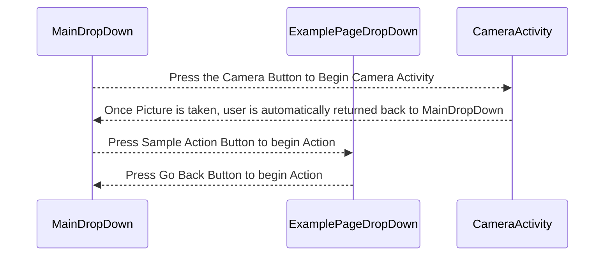

This plugin was developed to provide a starting point to build off of if your plugin requires the use of capturing a still image using the default Android camera application. 



The `CameraActivity` class is an example of how to add an Activity to your ATAK plugin. When you select the   toolbar icon, the `MainDropDown` UI pane will display the Main Dropdown pane. The camera button on the right demonstrates how to launch the the Camera Activity with an intent while the text button on the left demonstrates how to create an intent to open a secondary Example Page for a plugin.

## How to build and run this plugin

1. Build the application signing keys which are required by the Android Operating System (OS) for security when installing software packages.
   At the bottom of the IDE there should be a *Terminal* tab you can open to launch a terminal session in the root folder of the plugin.

   ```sh
   # Run the following commands in your Android Studio Terminal
   # Generate Debug signing key: set "alias", "keypass", and "storepass" flag values as desired
   keytool -genkeypair -dname "CN=Android Debug,O=Android,C=US" -validity 9999 -keystore debug.keystore -alias androiddebugkey -keypass android -storepass android 
   
   # Generate Release signing key: set "alias", "keypass", and "storepass" flag values as desired
   keytool -genkeypair -dname "CN=Android Release,O=Android,C=US" -validity 9999 -keystore release.keystore -alias androidreleasekey -keypass android -storepass android 
   ```

2. Edit the `template-camera/local.properties` file to add the following lines.`<ANDROID_SDK_PATH>` and the `sdk.dir` should already be filled out by the IDE with the default Android SDK file path. `<ABSOLUTE_PLUGIN_PATH>` should be a complete file path to the root plugin folder. 
   Example plugin path: `C\:\\tak\\atak-civ-sdk-4.5.1.13\\atak-civ\\learnatak\\template-camera`

NOTE: Ensure your directory path is [escaped](https://www.gnu.org/software/bash/manual/html_node/Escape-Character.html) properly on Windows. Follow the default `sdk.dir` for formatting reference or the example path above. The most common mistake is forgetting the first escape character `C\:`. Gradle Exceptions will be thrown until your paths are correctly formatted.

```ini
   sdk.dir=<ANDROID_SDK_PATH>
   takDebugKeyFile=<ABSOLUTE_PLUGIN_PATH>\\debug.keystore
   takDebugKeyFilePassword=android
   takDebugKeyAlias=androiddebugkey
   takDebugKeyPassword=android
   
   takReleaseKeyFile=<ABSOLUTE_PLUGIN_PATH>\\release.keystore
   takReleaseKeyFilePassword=android
   takReleaseKeyAlias=androidreleasekey
   takReleaseKeyPassword=android
```

3. We recommend setting your JDK (java version) to `version 11` 

4. Ensure **Build Variant** option is selected to "civDebug"

## First Steps to Modify Template

Look for the `// TODO` comments within the project to be reminded or directed towards areas that need modification or your plugin's logic. Android Studio is based on the Intellij IDE which has a [TODO](https://www.jetbrains.com/help/idea/using-todo.html) tab to view a list of all comments containing TODO items.