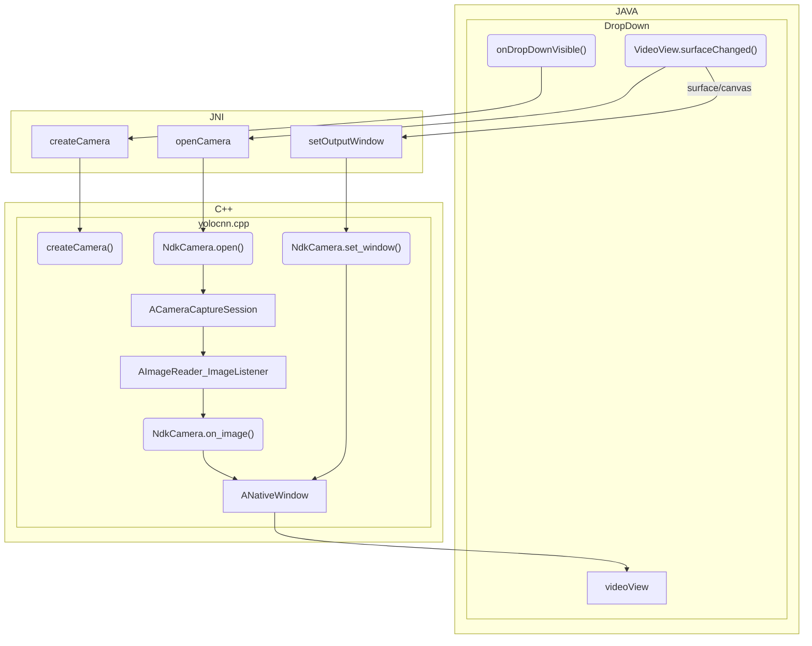

This plugin was developed as a stepping stone to isolate the camera functionality of the Convolutional Neural Network plugin. The goal of this plugin is to introduce how one can integrate a live camera feed into an ATAK Dropdown pane using [OpenCV](https://github.com/opencv/opencv) and [ncnn](https://github.com/Tencent/ncnn). The `ncnn` library provides us with the necessary matrix conversions to properly rotate and map the image pixels to the display and an established set of Java Native Interface (JNI) methods to incorporate into the plugin. When loaded, the plugin can be found in the ATAK [tools](../../atak_development/atak_quick_reference/#terminology) as a video camera icon as shown in the title.


## How to build and run this plugin

When building/running this plugin first ensure you have the listed dependencies then proceed to the [Quick Reference](#quick-reference) section.

### Dependencies

- [CMake](https://cmake.org/download/)
    1. Download and install CMake.
        - Windows: advised to download the latest `*.msi` on the page linked above and follow the default options in the installer. Ensure it is included in your environment path.
        - Linux: run `sudo apt install cmake` in a terminal session
    2. Restart all terminal sessions and ensure installation works.
       The command `cmake --version` should result in `cmake version <VERSION_NUMBER>`.
       **MAY REQUIRE SYSTEM REBOOT**
    3. Specify your version of CMake in the `cmake_version` variable of the `local.properties` file.

- [OpenCV for Android version 4.6.0](https://sourceforge.net/projects/opencvlibrary/files/4.6.0/opencv-4.6.0-android-sdk.zip/download)

    1. Click the link above to download OpenCV version 4.6.0 for Android.
    2. Extract the zip archive to place the contents in:
        - Windows: `C:\tak\AndroidLibs\opencv-4.6.0-android-sdk`
        - Linux: `/<ATAK_SDK_PATH>/atak-civ/AndroidLibs/OpenCV-android-sdk`
    3. Specify your install path in the `opencv_dir` variable of the `local.properties` file.


- [NCNN Android Vulkan 20221128](https://sourceforge.net/projects/ncnn.mirror/files/20221128/ncnn-20221128-android-vulkan.zip/download)

    1. Click the link above to download ncnn build number 20221128 .
    2. Extract the zip archive to place the contents in:
        - Windows: `C:\tak\AndroidLibs\ncnn-20221128-android-vulkan`
        - Linux: `/<ATAK_SDK_PATH>/atak-civ/AndroidLibs/ncnn-20221128-android-vulkan`
    3. Specify your install path in the `ncnn_dir` variable of the `local.properties` file.

- [Ninja Build System](https://github.com/ninja-build/ninja/releases)

    1. Download and install Ninja
        - Windows:
            1. Click the link above to navigate to the GitHub ninja release page.
            2. Select the latest asset `*.zip` download (at the time of writing we downloaded v1.11.1)
            3. Extract the zip archive to your desired path. It should only have one executable `ninja.exe`.
               We placed the executable at `c:\tak\win-ninja\ninja.exe`.
            4. Add `ninja.exe` to System Environment Variables.
               Open Environment Variables window. Find "Path" in the "System variables" view. Select "Edit" then press "New". Add the complete path to the folder holding your ninja executable `C:\tak\win-ninja`.
        - Linux:
            1. Run `sudo apt install ninja-build` in terminal.
            2. Locate installation directory with `which ninja` command
    2. Ensure install works. Open up a terminal session and enter `ninja --version`. You should see `1.11.1` or the version you installed.

  **MAY REQUIRE SYSTEM REBOOT.**

<br>

### Quick Reference

1. Build the application signing keys which are required by the Android Operating System (OS) for security when installing software packages.
   At the bottom of the IDE there should be a *Terminal* tab you can open to launch a terminal session in the root folder of the plugin.

   ```sh
   # Run the following commands in your Android Studio Terminal
   # Generate Debug signing key: set "alias", "keypass", and "storepass" flag values as desired
   keytool -genkeypair -dname "CN=Android Debug,O=Android,C=US" -validity 9999 -keystore debug.keystore -alias androiddebugkey -keypass android -storepass android 
   
   # Generate Release signing key: set "alias", "keypass", and "storepass" flag values as desired
   keytool -genkeypair -dname "CN=Android Release,O=Android,C=US" -validity 9999 -keystore release.keystore -alias androidreleasekey -keypass android -storepass android
   ```

2. Edit the `demo-camera/local.properties` file to add the following lines.`<ANDROID_SDK_PATH>` and the `sdk.dir` should already be filled out by the IDE with the default Android SDK file path. The key here is to specify the paths to your signing keys, OpenCV library, and `ncnn` library. It is also required to specify the CMake version you have installed.
   `<ABSOLUTE_PLUGIN_PATH>` should be a complete file path to the root plugin folder;
   example plugin path: `C\:\\tak\\atak-civ-sdk-4.5.1.13\\atak-civ\\learnatak\\demo-camera`

NOTE: Ensure your directory path is [escaped](https://www.gnu.org/software/bash/manual/html_node/Escape-Character.html) properly on Windows. Follow the default `sdk.dir` for formatting reference or the example path above. The most common mistake is forgetting the first escape character `C\:`. Gradle Exceptions will be thrown until your paths are correctly formatted.


```ini
sdk.dir=<ANDROID_SDK_PATH>
takDebugKeyFile=<ABSOLUTE_PLUGIN_PATH>\\debug.keystore
takDebugKeyFilePassword=android
takDebugKeyAlias=androiddebugkey
takDebugKeyPassword=android

takReleaseKeyFile=<ABSOLUTE_PLUGIN_PATH>\\release.keystore
takReleaseKeyFilePassword=android
takReleaseKeyAlias=androidreleasekey
takReleaseKeyPassword=android

cmake_version=3.23.2
opencv_dir="C:\\tak\\AndroidLibs\\opencv-4.6.0-android-sdk"
ncnn_dir="C:\\tak\\AndroidLibs\\ncnn-20221128-android-vulkan"
```

## Logcat Filter

Copy and paste this in the filter field of the [Logcat](https://developer.android.com/studio/debug/logcat) to make it easier to follow the feed of log messages that are printed by the demo camera plugin to help further your understanding of the code in the project.

```sh
# FILTER
package:com.atakmap.app.civ tag:DemoCameraDropDownReceiver tag:NdkCamera tag:ncnn 
# Debug Filter reduce noise
-tag:NdkCameraWindow -tag:GLMapRenderer -tag:DisplayDeviceRepository -tag:HWComposer -tag:LocSvc_ApiV02 -tag:GEL_DELAYED_EVENT_DEBUG -tag:CommsMapComponentCommo -tag:NetworkScheduler -tag:ConnectivityService -tag:ActivityManager -tag:AiAiEcho -tag:Dt2FileWatcher -tag:Thread-23 -tag:ColorDisplayService -tag:NetworkUtils -tag:CarrierServices -tag:SEE -tag:VSC -tag:ASH -tag:atakmap.app.ci -tag:-tag:NdkCameraWindow -tag:GLMapRenderer -tag:DisplayDeviceRepository -tag:HWComposer -tag:LocSvc_ApiV02 -tag:GEL_DELAYED_EVENT_DEBUG -tag:CommsMapComponentCommo -tag:NetworkScheduler -tag:ConnectivityService -tag:ActivityManager -tag:AiAiEcho -tag:Dt2FileWatcher -tag:Thread-23 -tag:ColorDisplayService -tag:NetworkUtils -tag:CarrierServices -tag:SEE -tag:VSC -tag:ASH -tag:atakmap.app.ci -tag:CHRE 

```

## Potential Errors

#### 1. OpenCV not provided

If you see the following stack trace error when trying to build the application there is an issue with your installation of OpenCV.

If you have installed and extracted the library as outlined in the [dependencies](#dependencies) section it is likely just an issue with the `opencv_dir` path provided in the `local.properties` file.

```verilog
CMake Error at CMakeLists.txt:6 (find_package):
By not providing "FindOpenCV.cmake" in CMAKE_MODULE_PATH this project has asked CMake to find a package configuration file provided by "OpenCV", but CMake did not find one. Could not find a package configuration file provided by "OpenCV" with any of the following names:
OpenCVConfig.cmake
opencv-config.cmake
Add the installation prefix of "OpenCV" to CMAKE_PREFIX_PATH or set "OpenCV_DIR" to a directory containing one of the above files. If "OpenCV" provides a separate development package or SDK, be sure it has been installed.
```

#### 2. CMake Error and Ninja

If you see the following stack trace error when trying to build the application there is an issue with your installation of ninja. First attempt to restart Android Studio to resolve this issue, if that doesn't work then a complete computer reboot should fix this issue.

```verilog
CMake Error: CMake was unable to find a build program corresponding to "Ninja". CMAKE_MAKE_PROGRAM is not set. You probably need to select a different build tool.
```

## Plugin Code Overview

The rest of this document will provide a high level overview to help introduce and orient developers to the source code that drives this plugin. The goal is to help readers gain confidence to understand how to modify this project to meet their needs.



The diagram above shows how the plugin pane utilizes our [Java Native Interface NcnnYolov7](https://github.com/Toyon/LearnATAK/tree/master/demo-camera/app/src/main/java/com/toyon/democamera/NcnnYolov7.java) which leverages [the Android Camera Native Development Kit(NDK)](https://developer.android.com/ndk/reference/group/camera) C++ interface to capture frames from the device's camera feed to display on within a layout defined View resource. The diagram only focuses on the camera capture session initialization in an attempt to simplify the steps involved and help you understand the general approach to understand how Java function calls in the plugin's main dropdown receiver class ([DemoCameraDropDownReceiver.java](https://github.com/Toyon/LearnATAK/tree/master/demo-camera/app/src/main/java/com/toyon/democamera/DemoCameraDropDownReceiver.java)) make their way through the JNI Java ([NcnnYolov7.java](https://github.com/Toyon/LearnATAK/tree/master/demo-camera/app/src/main/java/com/toyon/democamera/NcnnYolov7.java)) and C++ ([yolocnn.cpp](https://github.com/Toyon/LearnATAK/tree/master/demo-camera/app/src/main/jni/yoloncnn.cpp)) interface classes to the actual native development implementation ([ndkcamera.cpp](https://github.com/Toyon/LearnATAK/tree/master/demo-camera/app/src/main/jni/ndkcamera.cpp)) to feed imagery back to the Java managed content pane.

### 1. Java Plugin Entry Point

The best place to start understanding the plugin's implementation details is with the primary [dropdown receiver](https://github.com/Toyon/LearnATAK/tree/master/demo-camera/app/src/main/java/com/toyon/democamera/DemoCameraDropDownReceiver.java) as that is where the top level function calls are made for integrating the native camera feed into the ATAK plugin view. 

The [following snippet](https://github.com/Toyon/LearnATAK/tree/master/demo-camera/app/src/main/java/com/toyon/democamera/DemoCameraDropDownReceiver.java#L70-77) is key to initializing the native camera feed, providing our native implementation information about the device's configuration (orientation), and providing the canvas to the `surfaceView` which enables the native code to render the image feed within our plugin's UI panel. The `mVideoView` is a [`SurfaceView`](https://developer.android.com/reference/kotlin/android/view/SurfaceView?hl=en) in our plugin's layout, and is initialized in the constructor of the drop down receiver. We provide our native camera implementation the preferred display orientation based on the ATAK preference to help determine the proper translation of the pixels to ensure the image feed always displays right side up. to the plugin pane to the preferred orientation based on the orientation of ATAK. Given the aspect ratio of processed imagery we set the surface view's format to [`PixelFormat.RGBA_8888`](https://developer.android.com/reference/android/graphics/PixelFormat#RGBA_8888) to ensure the images are properly rendered in the pane. 

```c
ncnnyolov7.createCamera();
ncnnyolov7.setAssetManager(pluginCtx.getAssets());
int orientation = AtakPreferenceFragment.getOrientation(getMapView().getContext());
ncnnyolov7.setPrefOrientation(orientation);

// when visible again re-create the surface
mVideoView.getHolder().setFormat(PixelFormat.RGBA_8888);
mVideoView.getHolder().addCallback(this);
```

Since C++ doesn't have any garbage collection it is important our plugin properly cleans up memory usage when the native camera feed is no longer needed. The [snippet below](https://github.com/Toyon/LearnATAK/tree/master/demo-camera/app/src/main/java/com/toyon/democamera/DemoCameraDropDownReceiver.java#L114-L122) shows the necessary steps required to properly release the native resources by closing the camera session, destroying / destructing the native camera object, and releasing the render window asset. That is followed by releasing the resources associated with the rendering surface. This is done in the rendering surface's destruction callback since that will be called when the plugin pane UI is closed and the UI pane can no longer render imagery from the camera.


```java
public void surfaceDestroyed(SurfaceHolder holder) {
    // release the surface view as it will be re-created when the plugin becomes visible
    Log.i(TAG, "Surface destroyed");
    ncnnyolov7.closeCamera();
    ncnnyolov7.destroyCamera();
    ncnnyolov7.releaseOutputWindow(holder.getSurface());
    mVideoView.getHolder().removeCallback(this);
    mVideoView.getHolder().getSurface().release();
}
```

To handle orientation changes of the device and any structural changes to the render surface, the [code below](https://github.com/Toyon/LearnATAK/tree/master/demo-camera/app/src/main/java/com/toyon/democamera/DemoCameraDropDownReceiver.javaL101-108) ensures the native camera implementation has a valid object to render images on and starts a new camera capture session.

```java
public void surfaceChanged(SurfaceHolder holder, int format, int width, int height) {
    Log.i(TAG, String.format(Locale.US,  "Surface changed to format %s width %d height %d",
            format, width, height));
    ncnnyolov7.setOutputWindow(holder.getSurface());

    Log.i(TAG, "openCamera");
    ncnnyolov7.openCamera();
}
```

### 2. JNI Mapping Java to C++

There are two files in this project that make up the Java Native Interface (JNI) mapping to enable our Java plugin to make calls to our native implementation derived from the [sample project of the `ncnn` library](https://github.com/xiang-wuu/ncnn-android-yolov7/blob/master/README.md). The Java mapping can be found at [NcnnYolov7.java](https://github.com/Toyon/LearnATAK/tree/master/demo-camera/app/src/main/java/com/toyon/democamera/NcnnYolov7.java) with the accompanying C++ mapping at [yolocnn.cpp](https://github.com/Toyon/LearnATAK/tree/master/demo-camera/app/src/main/java/com/toyon/democamera/NcnnYolov7.java). Each function defined in the `NcnnYolov7` class that includes `native` in the function signature has an accompanying `JNIExport <RETURN-TYPE> JNICALL Java_com_atakmap_android_democamera_NcnnYolov7_<FUNCTION-NAME>`implementation in the C++ file. 

These C++ mapped functions primary serve as a way to interact with a global pointer to an `MyNdkCamera` class which helps interact with the [Android Camera NDK](https://developer.android.com/ndk/reference/group/camera) to perform the necessary steps to setup or destroy a native camera feed to render within a custom plugin/application layout. Some of the functions also work directly with the [native window NDK](https://developer.android.com/ndk/reference/group/a-native-window) to assist the `g_camera` pointer in setting up the image feed.

These functions are well-described by their names and follow their logical workflows. For example the camera must be created before it can be opened ([createCamera()](https://github.com/Toyon/LearnATAK/tree/master/demo-camera/app/src/main/java/com/toyon/democamera/NcnnYolov7.java#L22) must be invoked before [openCamera()](https://github.com/Toyon/LearnATAK/tree/master/demo-camera/app/src/main/java/com/toyon/democamera/NcnnYolov7.java#L23)) and cameras must be closed before they can be destroy ([closeCamera()](https://github.com/Toyon/LearnATAK/tree/master/demo-camera/app/src/main/java/com/toyon/democamera/NcnnYolov7.java#L24) must be invoked before [destroyCamera()](https://github.com/Toyon/LearnATAK/tree/master/demo-camera/app/src/main/java/com/toyon/democamera/NcnnYolov7.java#L25)).

- `createCamera()` [Java](https://github.com/Toyon/LearnATAK/tree/master/demo-camera/app/src/main/java/com/toyon/democamera/NcnnYolov7.java#L22), [C++](https://github.com/Toyon/LearnATAK/tree/master/demo-camera/app/src/main/jni/yoloncnn.cpp#L108-115): create a new `MyNdkCamera` object and assign it to the global camera pointer `g_camera`
- `openCamera()` [Java](https://github.com/Toyon/LearnATAK/tree/master/demo-camera/app/src/main/java/com/toyon/democamera/NcnnYolov7.java#23), [C++](https://github.com/Toyon/LearnATAK/tree/master/demo-camera/app/src/main/jni/yoloncnn.cpp#L117-124): executes the `MyNdkCamera` open procedure to begin capturing images
- `closeCamera()` [Java](https://github.com/Toyon/LearnATAK/tree/master/demo-camera/app/src/main/java/com/toyon/democamera/NcnnYolov7.java#L24), [C++](https://github.com/Toyon/LearnATAK/tree/master/demo-camera/app/src/main/jni/yoloncnn.cpp#L126-133): executes the `MyNdkCamera` close procedures to shutdown the native image capture
- `destroyCamera()` [Java](https://github.com/Toyon/LearnATAK/tree/master/demo-camera/app/src/main/java/com/toyon/democamera/NcnnYolov7.java#L25), [C++](https://github.com/Toyon/LearnATAK/tree/master/demo-camera/app/src/main/jni/yoloncnn.cpp#L135-143): cleans up the `MyNdkCamera` resources, destroys the camera object and clears the global pointer
- `setOutputWindow(Surface surface)` [Java](https://github.com/Toyon/LearnATAK/tree/master/demo-camera/app/src/main/java/com/toyon/democamera/NcnnYolov7.java#L26), [C++](https://github.com/Toyon/LearnATAK/tree/master/demo-camera/app/src/main/jni/yoloncnn.cpp#L145-154): allows the Java plugin to provide a reference to the layout surface for the native camera stream to render the camera stream frames
- `releaseOutputWindow(Surface surface)` [Java](https://github.com/Toyon/LearnATAK/tree/master/demo-camera/app/src/main/java/com/toyon/democamera/NcnnYolov7.java#L27), [C++](https://github.com/Toyon/LearnATAK/tree/master/demo-camera/app/src/main/jni/yoloncnn.cpp#L156-167): allows the Java plugin to clear the reference to the layout surface for the native camera stream to avoid an attempt to render to a non-existent resource
- `setAssetManager(AssetManager assetManager)` [Java](https://github.com/Toyon/LearnATAK/tree/master/demo-camera/app/src/main/java/com/toyon/democamera/NcnnYolov7.java#L30), [C++](https://github.com/Toyon/LearnATAK/tree/master/demo-camera/app/src/main/jni/yoloncnn.cpp#L169-175): allows the Java plugin to provide more info on the device's current orientation to the native camera logic
- `setPrefOrientation(int orientation)` [Java](https://github.com/Toyon/LearnATAK/tree/master/demo-camera/app/src/main/java/com/toyon/democamera/NcnnYolov7.java#L31), [C++](https://github.com/Toyon/LearnATAK/tree/master/demo-camera/app/src/main/jni/yoloncnn.cpp#L177-180): allows the Java plugin to provide more info on the device ATAK application's configured orientation to help translate the captured image to the proper display rotation

### 3. Native Camera Code C++

The primary class that executes all the Android Camera NDK function calls to setup a native camera rendering stream is the [`MyNdkCamera`](https://github.com/Toyon/LearnATAK/tree/master/demo-camera/app/src/main/jni/yoloncnn.cpp#L77-81) which inherits from the [`NdkCameraWindow`](https://github.com/Toyon/LearnATAK/tree/master/demo-camera/app/src/main/jni/ndkcamera.h#L61-89) which inherits from the [`NdkCamera`](https://github.com/Toyon/LearnATAK/tree/master/demo-camera/app/src/main/jni/ndkcamera.h#L31-59) class. These classes help separate the concerns of the setup for the camera stream. 

- `NdkCamera` is responsible for opening and closing the camera feed as well as providing the primary driving `on_image` callback to process every frame captured by the camera feed
- `NdkCameraWindow` is responsible for providing the logic to render the image frames onto the layout surface which is why it implements the functions `setAssetManager(AssetManager assetManager)` and `setPrefOrientation(int orientation)` to translate/transform the raw image pixels to render in the proper orientation within the plugin window. It also implements the functions to maintain knowledge of the rendering surface with `setOutputWindow(Surface surface)` and `releaseOutputWindow(Surface surface)`
- `MyNdkCamera` is responsible for annotating the rendered image and in the Demo CNN plugin does additional processing on the image frames as they are displayed.

We won't cover the details of the Android Native Development Kit in this document, and advise you leverage the modifications made to these classes within your own plugins that require a live stream of camera frames to be displayed within the plugin's layout. It is advised to add any additional image processing within the [`MyNdkCamera::on_image_render(cv::Mat& rgb)`](https://github.com/Toyon/LearnATAK/tree/master/demo-camera/app/src/main/jni/yoloncnn.cpp#L83-89).