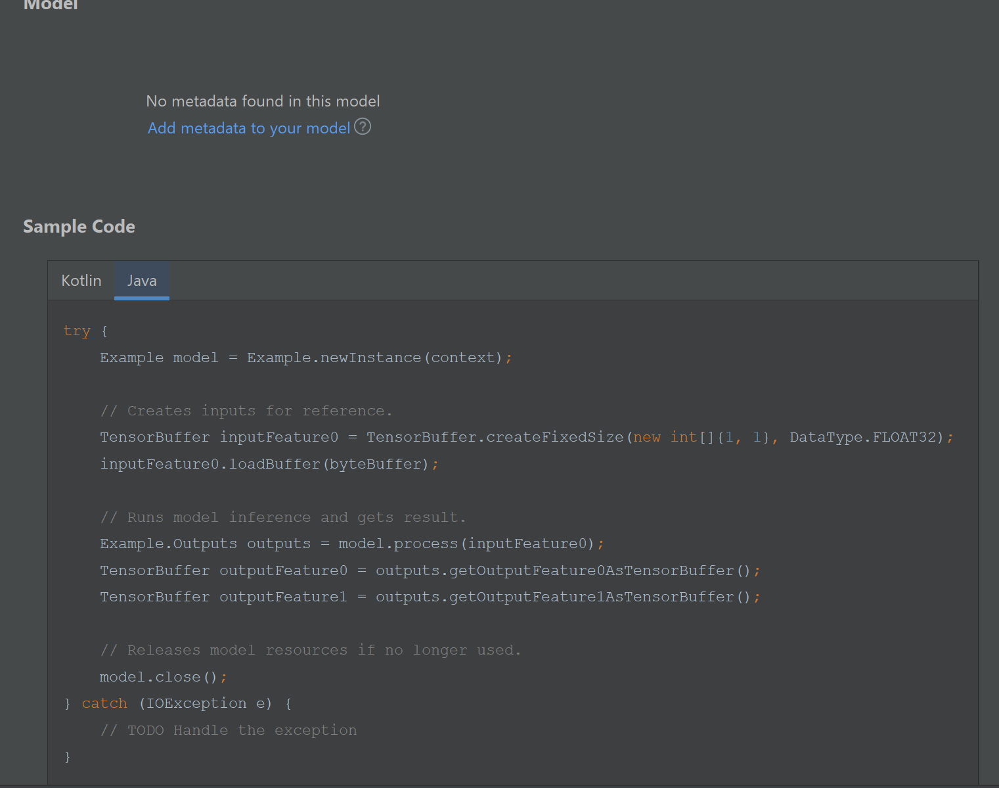

*Updated: 5 July 2023*

After following the steps outlined in ["Configure ATAK Plugin for TensorFlow Lite"](../plugin_config_ml/), you should now be ready to access your trained model within your plugin to perform [inference](../ml_terminology/#inference) and optionally access model information or perform on-device training/modifications.

### Contents:

1. [Preparing Model: Viewing Model Files](#viewing-model-files)
2. [Preparing Model: Generate Wrapper Class](#generate-wrapper-class)
3. [Use Model: Basic Inference](#basic-inference)
4. [Use Model: Load Model and create Interpreter](#loading-a-model-and-creating-an-interpreter)
5. [Use Model: Access Model Functions with Signatures](#access-model-functions-with-signatures)
6. [Use Model: Model Input/Output Data Format ](#model-data-format)
7. [Use Model: Retrieving Output](#retrieving-output)
8. [Potential Performance Issues](#potential-performance-issues)
9. [Sample TFLite Wrapper Class](#tflite-wrapper-code)

## Viewing Model Files

Opening your `.tflite` file inside Android Studio will show the following display in the editor pane. 




<!-- <p style="text-align: center;"><a href="../src/main/ml/example.tflite">demotflite/app/src/main/ml/example.tflite</a></p> -->

Neither of the example models included in this project include [metadata](https://www.tensorflow.org/lite/models/convert/metadata). The model view above shows this project's *Example TF Lite model*. The pane shows sample code to interact with the TFLite model, and would include the meta data description if this model had metadata. 
The models included in the project:

- `src/main/ml/lite-model_regnety600mf_feature_extractor.tflite`: [RegNetY 600MF feature extractor pretrained on ImageNet-1k](https://tfhub.dev/adityakane2001/lite-model/regnety600mf_feature_extractor/1) 
- `src/main/ml/example.tflite`: [ML Training TensorFlow Lite Sample Model](../../ml-training/)

## Generating Wrapper Classes

After importing a model into your project you are nearly ready to use model in your plugin code. Select `Build` > `Make Project` for the *Android Studio ML Model Binding Plugin* to generate a wrapper class that will allow you to input data and retrieve outputs in your plugin source code. If you followed [our previous steps](../plugin_config_ml/#3-import-a-tensorflow-lite-model) you should be able to view the generated class at the following path:
`app/build/generated/ml_source_out/<BUILD_VARIANT>/<PLUGIN_PACKAGE>/ML/<MODEL_NAME>.tflite`

- `BUILD_VARIANT`: an option selected in the "Build Variants" tab as an option specified by the template Gradle file. 
  It should be set to `civDebug` for all plugins in this repository
- `PLUGIN_PACKAGE`: path defined in the `AndroidManifest.xml` for your project
- `MODEL_NAME`: name of your TFLite model

## Basic Inference

The wrapper classes are generated to have one entry method to use the model for inference. The following line is the function signature of the generated `Example` model class which is used for input/output (I/O) to get results from the model.

```java
public Outputs process(@NonNull TensorBuffer inputFeature0) { ... }
```

The expected inputs and outputs for inference depend on the model, and these details should be found on any additional documentation, such as the TFHub page where the model was downloaded, or the source of the module.

If you *only* desire to perform inference, you can use this generated class. You will have to use either a single or multiple `TensorBuffer` objects for the I/O. The next section will explain the `TensorBuffer` class and show you how to use the TF Interpreter API to call `@tf.functions`. [&#8657;](#contents)

## Using the Interpreter API

We created a `com.toyon.tfliteexample.TFLiteUtils` class to demonstrate common functions you will likely need when writing code to interact with a TFLite model using TensorFlow's Interpreter API. The [Interpreter API](https://www.tensorflow.org/lite/api_docs/java/org/tensorflow/lite/InterpreterApi) is an interface to work with a TensorFlow Lite model [interpreter](https://www.tensorflow.org/lite/api_docs/java/org/tensorflow/lite/Interpreter) which is a driver class for model inference. The following sections elaborate on how these helper methods work and can be used in your development. [&#8657;](#contents)

#### Loading a model and creating an interpreter

Source Code: [`TFLiteUtils.loadAsset`](https://github.com/Toyon/LearnATAK/tree/master/demotflite/app/src/main/java/com/toyon/tfliteexample/TFLiteUtils.java#39-42)
An interpreter can be created by using the `org.tensorflow.lite.support.common.FileUtil` class to load a model file. Use your plugin `context` or if developing a standalone application use the Activity or Application context. Use the name of your model in the `ml` directory for the `fileName` (no paths). [&#8657;](#contents)

```java
MappedByteBuffer modelFile = FileUtil.loadMappedFile(context, fileName);
Interpreter interpreter = new Interpreter(modelFile, new Interpreter.Options());
```

#### Access Model Functions with Signatures

Source Code: [`ExampleFunctionWrapper`](https://github.com/Toyon/LearnATAK/tree/master/demotflite/app/src/main/java/com/toyon/tfliteexample/TFLiteUtils.java)
When using a model that has implemented TensorFlow Functions ([`tf.function`](https://www.tensorflow.org/api_docs/python/tf/function)), they can be accessed in our Android plugin or application using the interpreter API as long as those functions were defined with a [signature](https://www.tensorflow.org/lite/guide/signatures?hl=en) key when [saving the model](https://www.tensorflow.org/api_docs/python/tf/saved_model/save).

Recall that our [`example.tflite` model](https://github.com/Toyon/LearnATAK/tree/master/demotflite/app/src/main/ml/example.tflite) has 3 exported functions which were defined in the [`main_export_example_tflite.py`](https://github.com/Toyon/LearnATAK/tree/master/ml_training/tflite/main_export_example_tflite.py) script.

```python
signatures={
	'get_weights': model.get_weights.get_concrete_function(),
	'set_weights': model.set_weights.get_concrete_function(),
	'predict': model.predict.get_concrete_function(),
}
```

You can call one of this methods using `interpreter.runSignature(input, output, signatureName);`, where `signatureName` is the String key, and `input` and `output` are of type `Map<String, ByteBuffer>`. For the input and output maps, the keys are the names of the function arguments and the names of the returns map keys.

For example, recall the example [`get_weights`](https://github.com/Toyon/LearnATAK/tree/master/ml_training/tflite/example_module.py#76-93) function:

```python
    @tf.function(input_signature=[
        tf.TensorSpec([1, 1], tf.float32)
    ])
    def get_weights(self, dummy_input):
        vars1: List[tf.Variable] = self.model.layers[0].weights
        dense = tf.convert_to_tensor(vars1[0])
        bias = tf.convert_to_tensor(vars1[1])
        return {'dense': dense, 'bias': bias}
```

This has one argument, `dummy_input` (of size `[1, 1]` and type `float32`), and two outputs (returned as one map in Python),  `dense` and `bias`.  While the sizes of `dense` and `bias` are not included in the function definition, they are not unknown- internally, TensorFlow determines the expected size of each output during export.

If you are unsure of input and output names, you can use the interpreter to log the names for a given signature with the lines below. The [`TFLiteUtils.debugSignature`](https://github.com/Toyon/LearnATAK/tree/master/demotflite/app/src/main/java/com/toyon/tfliteexample/TFLiteUtils.java#50-54) can also is a sample helper method which you can define in your own projects as well.
*Note: If functions do not return a map and instead return a single value, the sole output is usually named `output0`*  [&#8657;](#contents)

```java
Log.i(TAG, String.join(", ", interpreter.getSignatureInputs(signatureName)));
Log.i(TAG, String.join(", ", interpreter.getSignatureOutputs(signatureName)));
```

#### Model Data Format

TensorFlow Lite on Android devices use [`ByteBuffer`](https://docs.oracle.com/javase/8/docs/api/java/nio/ByteBuffer.html) objects to pass data in and out of the model. The autogenerated model wrapper class uses [`TensorBuffer`](https://www.tensorflow.org/lite/api_docs/java/org/tensorflow/lite/support/tensorbuffer/TensorBuffer?hl=en) which at its core is really just a `ByteBuffer` with additional helper methods. For input data, we turn our data (such as a `float[]`) into a `ByteBuffer`, and for output data we allocate an empty `ByteBuffer` of the correct size.  [&#8657;](#contents)

##### Example Input Buffer Allocation: 

Source Code:  [`TFLiteUtils.getEmptyInputBuffer`](https://github.com/Toyon/LearnATAK/tree/master/demotflite/app/src/main/java/com/toyon/tfliteexample/TFLiteUtils.java#111-118) &  [`TFLiteUtils.createFloatBuffer`](https://github.com/Toyon/LearnATAK/tree/master/demotflite/app/src/main/java/com/toyon/tfliteexample/TFLiteUtils.java#127-131)
You can get the type and size of an input using the [`Tensor`](https://www.tensorflow.org/lite/api_docs/java/org/tensorflow/lite/Tensor?hl=en) object mapped to a signatures `sigName` input name `inputName`.

```java
Tensor t = in.getInputTensorFromSignature(inputName, sigName);
int[] shape = t.shape(); // Ex. [2, 2, 2] would be a 2x2x2 matrix
DataType dataType = t.dataType();
```

With this info you can then map your data into a properly typed buffer. For example, here is turning a `float[]` array into a `float32` `ByteBuffer`.

```java
float[] data = ... // Your data must be flattened. Ex. A [2, 2, 2] input would be a float array of size 8
TensorBuffer tb = TensorBufferFloat.createDynamic(DataType.FLOAT32);
tb.loadArray(data, shape);
ByteBuffer inputBuffer = tb.getBuffer();
```

Then using the mapped input `ByteBuffer`, construct your input map. [&#8657;](#contents)

```java
Map<String, Object> input = new HashMap<>();
input.put(inputName, inputBuffer);
```

##### Example Output Buffer Allocation:

Source Code: [`TFLiteUtils.getOutputBuffer`](https://github.com/Toyon/LearnATAK/tree/master/demotflite/app/src/main/java/com/toyon/tfliteexample/TFLiteUtils.java#64-71) &  [`TFLiteUtils.setupOutputMap`](https://github.com/Toyon/LearnATAK/tree/master/demotflite/app/src/main/java/com/toyon/tfliteexample/TFLiteUtils.java#80-84) & [`TFLiteUtils.setupOutput`](https://github.com/Toyon/LearnATAK/tree/master/demotflite/app/src/main/java/com/toyon/tfliteexample/TFLiteUtils.java#93-98) 
Similarly, you can get the output `ByteBuffer` description from a `Tensor`

```java
Tensor t = in.getOutputTensorFromSignature(outputName, signatureName);
ByteBuffer outputBuffer = TensorBuffer.createFixedSize(t.shape(), t.dataType()).getBuffer();
```

And load it into an output map:

```java
Map<String, Object> output = new HashMap<>();
output.put(outputName, outputBuffer);
```

We also included a helper method,  `TFLiteUtils.setupOutput(Interpreter, Map<String, Object>, String)`, that takes your interpreter, empty map, and signature name; and populates it with the current byte buffers. [&#8657;](#contents)

#### Retrieving Output

After running a `tf.function` using the `interpreter.runSignature` method, the output values will be accessible from the pre-allocated output map buffers. 
To turn the output data back into a `float[]`, do the following:

```java
ByteBuffer buf = (ByteBuffer) output.get(outputName);
buf.rewind();
FloatBuffer fb = buf.asFloatBuffer();
float[] yourData = new float[fb.capacity()];
fb.get(yourData);
// yourData now contains the contents of buf
```

*Note: For types other than float, see [ByteBuffer's Documentation](https://docs.oracle.com/javase/8/docs/api/java/nio/ByteBuffer.html)* [&#8657;](#contents)

## Potential Performance Issues

Inference on neural network models could be computationally expensive. To avoid freezing the main Android UI thread, consider calling model methods on a separate background thread.

The `Interpreter` class is not thread-safe. Ensure you create a new Interpreter for every thread. [&#8657;](#contents)

## TFLite Wrapper Code

Source Code: [`ExampleFunctionWrapper`](https://github.com/Toyon/LearnATAK/tree/master/demotflite/app/src/main/java/com/toyon/tfliteexample/ExampleFunctionWrapper.java)
The `ExampleFunctionWrapper` class demonstrates what was covered in [Access Model Function with Signature](#access-model-functions-with-signatures) showing complete examples to access exported TF functions `get_weights` and `set_weights` from the `example.tflite` model. The `predict` function is not included since it is covered by the ML Binding generated wrapper class method `Example.process`, but it's implementation is similar to the other functions. [&#8657;](#contents)