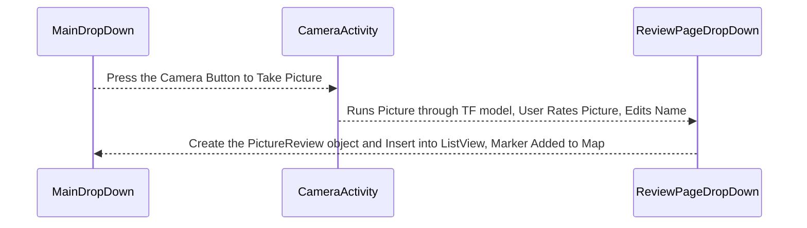

This plugin was developed to demonstrate how to use a pre-trained TFLite model in ATAK as well as showcase how to read, write and share TAK Data Packages using the ATAK API methods. 

## How to build and run this plugin

Quick Reference if you are building/running this plugin for the first time.

1. Build the application signing keys which are required by the Android Operating System (OS) for security when installing software packages.
   At the bottom of the IDE there should be a *Terminal* tab you can open to launch a terminal session in the root folder of the plugin.

   ```sh
   # Run the following commands in your Android Studio Terminal
   # Generate Debug signing key: set "alias", "keypass", and "storepass" flag values as desired
   keytool -genkeypair -dname "CN=Android Debug,O=Android,C=US" -validity 9999 -keystore debug.keystore -alias androiddebugkey -keypass android -storepass android 

   # Generate Release signing key: set "alias", "keypass", and "storepass" flag values as desired
   keytool -genkeypair -dname "CN=Android Release,O=Android,C=US" -validity 9999 -keystore release.keystore -alias androidreleasekey -keypass android -storepass android 
   ```

2. Edit the `demo-food-classifier/local.properties` file to add the following lines.
   `<ANDROID_SDK_PATH>` and the `sdk.dir` should already be filled out by the IDE with the default Android SDK file path
   `<ABSOLUTE_PLUGIN_PATH>` should be a complete file path to the root plugin folder;
   example plugin path: `C\:\\tak\\atak-civ-sdk-4.5.1.13\\atak-civ\\learnatak\\demo-food-classifier`

   ```ini
   # the sdk.dir should be automatically assigned to the path of your Android Studio SDK 
   sdk.dir=<ANDROID_SDK_PATH>  
   takDebugKeyFile=<ABSOLUTE_PLUGIN_PATH>\\debug.keystore
   takDebugKeyFilePassword=android
   takDebugKeyAlias=androiddebugkey
   takDebugKeyPassword=android

   takReleaseKeyFile=<ABSOLUTE_PLUGIN_PATH>\\release.keystore
   takReleaseKeyFilePassword=android
   takReleaseKeyAlias=androidreleasekey
   takReleaseKeyPassword=android
   ```

3. Make sure your JDK (java version) is set to `version 11`.
   Errors occasionally occur when Gradle settings are imported, so here are the necessary dependencies to import to run the project if they are not present.
   ### Dependencies
   ```groovy
    implementation 'androidx.appcompat:appcompat:1.5.1'
    implementation 'com.google.android.material:material:1.6.0'
    implementation 'androidx.constraintlayout:constraintlayout:2.1.4'
    testImplementation 'junit:junit:4.13.2'
    androidTestImplementation 'androidx.test.ext:junit:1.1.4'
    androidTestImplementation 'androidx.test.espresso:espresso-core:3.5.0'
    implementation fileTree(dir: 'libs', include: '*.jar')
    implementation 'org.tensorflow:tensorflow-lite-support:0.1.0'
    implementation 'org.tensorflow:tensorflow-lite-metadata:0.1.0'
    implementation 'org.tensorflow:tensorflow-lite-gpu:2.3.0'
    implementation 'org.tensorflow:tensorflow-lite-support:0.4.3'
    implementation 'androidx.recyclerview:recyclerview:1.3.0'
    implementation 'androidx.core:core-ktx:1.7.0'
    implementation "androidx.room:room-runtime:2.4.0"
    annotationProcessor "androidx.room:room-compiler:2.4.0"
   ```
   Ensure the `build.gradle`has the following set: `compileSDK = 33` and `minSDK = 28`. 

4. Ensure that the "Build Variant" is set to **civDebug**


## Plugin Workflow and Major Components


When the user first starts the plugin, they will see a list of food review records (this will be empty if this is the first time the plugin is ever opened). The user can press the camera button to take a picture. Once an image is captured and confirmed the user will be taken to a page where they can rate the food on a scale of 1 to 5 and edit the name if the the TFLite model classification isn't correct. Pressing the "submit" button will return the user to the main plugin pane where they should see their new food review item in the list as well as a map icon showing the users location when they submitted the review. 