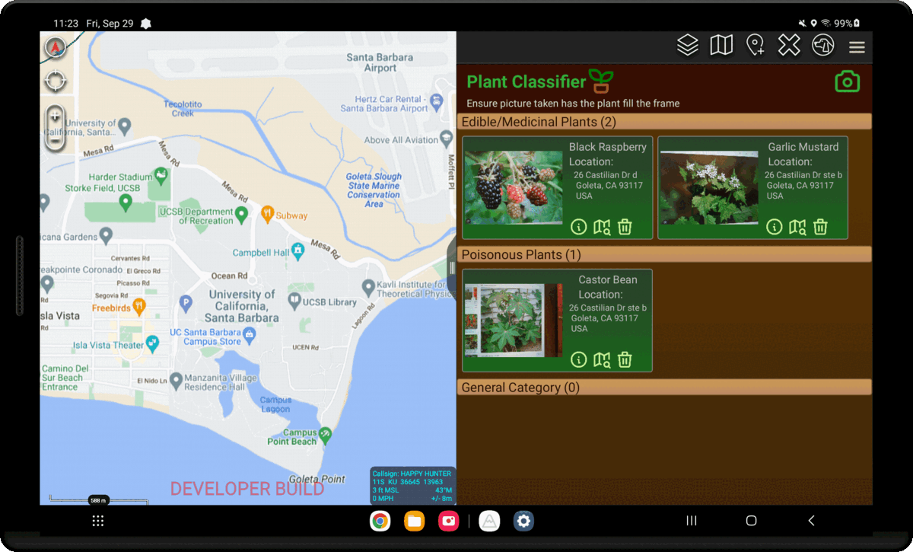
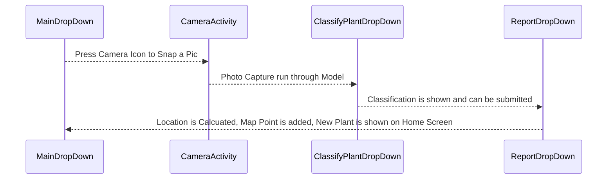

This plugin was developed to demonstrate how to use a pre-trained TFLite model in ATAK and store data using Room Database. 
In addition, an edible feature was added to confirm whether a plant was poisonous or edible.





## How to build and run this plugin

1. Build the application signing keys which are required by the Android Operating System (OS) for security when installing software packages.
   At the bottom of the IDE there should be a *Terminal* tab you can open to launch a terminal session in the root folder of the plugin.

   ```sh
   # Run the following commands in your Android Studio Terminal
   # Generate Debug signing key: set "alias", "keypass", and "storepass" flag values as desired
   keytool -genkeypair -dname "CN=Android Debug,O=Android,C=US" -validity 9999 -keystore debug.keystore -alias androiddebugkey -keypass android -storepass android 
   
   # Generate Release signing key: set "alias", "keypass", and "storepass" flag values as desired
   keytool -genkeypair -dname "CN=Android Release,O=Android,C=US" -validity 9999 -keystore release.keystore -alias androidreleasekey -keypass android -storepass android 
   ```

2. Edit the `demo-plant-classifier/local.properties` file to add the following lines.`<ANDROID_SDK_PATH>` and the `sdk.dir` should already be filled out by the IDE with the default Android SDK file path. The key here is to specify the paths to your signing keys,  OpenCV library, and  `ncnn` library. It is also required to specify the CMake version you have installed.
   `<ABSOLUTE_PLUGIN_PATH>` should be a complete file path to the root plugin folder;
   example plugin path: `C\:\\tak\\atak-civ-sdk-4.5.1.13\\atak-civ\\learnatak\\demo-plant-classifier`

   NOTE: Ensure your directory path is [escaped](https://www.gnu.org/software/bash/manual/html_node/Escape-Character.html) properly on Windows. Follow the default `sdk.dir` for formatting reference or the example path above. The most common mistake is forgetting the first escape character `C\:`. Gradle Exceptions will be thrown until your paths are correctly formatted.

   ```ini
   sdk.dir=<ANDROID_SDK_PATH>
   takDebugKeyFile=<ABSOLUTE_PLUGIN_PATH>\\debug.keystore
   takDebugKeyFilePassword=android
   takDebugKeyAlias=androiddebugkey
   takDebugKeyPassword=android
   
   takReleaseKeyFile=<ABSOLUTE_PLUGIN_PATH>\\release.keystore
   takReleaseKeyFilePassword=android
   takReleaseKeyAlias=androidreleasekey
   takReleaseKeyPassword=android
   
   cmake_version=3.23.2
   opencv_dir="C:\\tak\\AndroidLibs\\opencv-4.6.0-android-sdk"
   ncnn_dir="C:\\tak\\AndroidLibs\\ncnn-20221128-android-vulkan"
   ```

3. Make sure your JDK (java version) is set to `version 11`

### Dependencies

Make sure the dependencies in `app/build.gradle` include the following

   #### TFLite Requirements
   ```groovy
    implementation 'org.tensorflow:tensorflow-lite-support:0.4.3'
    implementation 'org.tensorflow:tensorflow-lite-metadata:0.1.0'
    implementation 'org.tensorflow:tensorflow-lite-gpu:2.3.0'
   ```

  #### Other
   ```groovy
    implementation 'androidx.appcompat:appcompat:1.5.1'
    implementation 'com.google.android.material:material:1.6.0'
    implementation 'androidx.constraintlayout:constraintlayout:2.1.4'
    implementation "androidx.fragment:fragment:1.5.7"
    implementation 'com.opencsv:opencsv:4.6'

    testImplementation 'junit:junit:4.13.2'
    androidTestImplementation 'androidx.test.ext:junit:1.1.4'
    androidTestImplementation 'androidx.test.espresso:espresso-core:3.5.0'

   ```


# Plugin Workflow and Major Components




This plugin can be broken down into 4 main classes, plus a few more classes under the hood.

## The 4 Main Classes 

Pressing the plugin's toolbar button will start the user at the home screen, [`MainDropDown`](https://github.com/Toyon/LearnATAK/tree/master/demo-plant-classifier/app/src/main/java/com/toyon/plantclassifier/MainDropDown.java). The main pane displays a list of categorized `PlantEntity` records objects. The main pane also has a [camera icon button](https://github.com/Toyon/LearnATAK/tree/master/demo-plant-classifier/app/src/main/java/com/toyon/plantclassifier/MainDropDown.java#L73-L83) that begins the process of creating a new plant record by capturing an image with the [default camera app](https://github.com/Toyon/LearnATAK/tree/master/demo-plant-classifier/app/src/main/java/com/toyon/plantclassifier/CameraActivity.java). The picture is then sent to the [`ClassifyPlantDropDown`](https://github.com/Toyon/LearnATAK/tree/master/demo-plant-classifier/app/src/main/java/com/toyon/plantclassifier/ClassifyPlantDropDown.java) receiver where it is run through a [`TFLite model`](https://github.com/Toyon/LearnATAK/tree/master/demo-plant-classifier/app/src/main/java/com/toyon/plantclassifier/ClassifyPlantDropDown.java#L82-L101) to output a classification label or its scientific name. Next, the predicted label is compared against records in a [`csv file`](https://github.com/Toyon/LearnATAK/tree/master/demo-plant-classifier/app/src/main/java/com/toyon/plantclassifier/ClassifyPlantDropDown.java#L103-L124) in order to try and determine the plant's common name and its edibility status. A summary of this information is transferred to the [`ReportDropDown`](https://github.com/Toyon/LearnATAK/tree/master/demo-plant-classifier/app/src/main/java/com/toyon/plantclassifier/ReportDropDown.java) where it is displayed and allows a user to supply extra information including notes and a description of the location where it was found. Pressing the [submit button](https://github.com/Toyon/LearnATAK/tree/master/demo-plant-classifier/app/src/main/java/com/toyon/plantclassifier/ReportDropDown.java#L78-L92) on the report pane sends the plant information object `MainDropDown` where a [GPS service class](https://github.com/Toyon/LearnATAK/tree/master/demo-plant-classifier/app/src/main/java/com/toyon/plantclassifier/GPSTracker.java) is used to get the user's [`current location`](https://github.com/Toyon/LearnATAK/tree/master/demo-plant-classifier/app/src/main/java/com/toyon/plantclassifier/MainDropDown.java#L111-L116) so it can display a [tree icon](https://github.com/Toyon/LearnATAK/tree/master/demo-plant-classifier/app/src/main/java/com/toyon/plantclassifier/MainDropDown.java#L121-L130) on the map where the photo was taken. Finally, the plant is added to the database and displayed on the Main Screen.

## Under the Hood 

Here are some classes working behind the scenes to make Plant classifier work.

   ### Adapters

Adapters in a `RecyclerView` allow you create performant dynamic list views in Android applications. Linking an adapter's data set to a `LiveData` object can also help you ensure that the list stays up to date when changes to data occur.  Returning a value of type [`LiveData`](https://developer.android.com/reference/androidx/lifecycle/LiveData) room in our data access object (DAO) query, leverages the Room library to generate all the necessary code to update the `LiveData` when the database is updated. This enables an adapter to `.observe()` the query results with a registered callback that updates the data set of the adapter resulting in the update of the `RecyclerView` UI to accurately reflect the state of the database. See an example of the use of `LiveData` with the [PlantCategoryAdapter](https://github.com/Toyon/LearnATAK/tree/master/demo-plant-classifier/app/src/main/java/com/toyon/plantclassifier/adapters/PlantCategoryAdapter.java#L43-L79). Opting to not use `LiveData` places the responsibility of registering and unregistering listeners properly based on the UI lifecycle which can be more error prone if you are not careful and aware of the intricacies of Android's Lifecycles.  Demo CNN's [MainDropDownReceiver](https://github.com/Toyon/LearnATAK/tree/master/democnn/app/src/main/java/com/toyon/democnn/MainDropDown.java#L87-L107) has an example of maintaining an up to date dynamic list with core Java data structures and ATAK event listeners.


   ### GPS Tracker 

The `GPSTracker` class extends an Android `Service` class and implements `LocationListener` in order to provide a convenient method to retrieve a user's current location. You can call it with: 

   ```java
GPSTracker gpsTracker = new GPSTracker(context);
if(gpsTracker.canGetLocation()) {
    double latitude = gpsTracker.getLatitude();
    double longitude = gpsTracker.getLongitude();
    GeoPoint coords = new GeoPoint(latitude, longitude);
}
   ```


<br>

## Storing data with Room Database

This plugin uses the Room persistence library to as a more convenient way to interact with a local SQLite database. If you are looking to implement an efficient way to store non-trivial amounts of structured data in your own plugin get started by including the following dependencies in your own plugin then check out the listed resources in the order presented to understand how to effectively use the library. You can skip ahead to the second item if you are already familiar with Room and just want to see the essential items required for use within an ATAK plugin.

   #### Room Database Requirements
   ```groovy
    def room_version = "2.5.2"
    implementation "androidx.room:room-ktx:2.5.2"
    implementation "androidx.room:room-runtime:$room_version"
    annotationProcessor "androidx.room:room-compiler:$room_version"
    testImplementation "androidx.room:room-testing:$room_version"
    implementation "androidx.room:room-paging:$room_version"
    implementation 'androidx.lifecycle:lifecycle-extensions:2.2.0'
   ```

1. See Android's official guide [Here](https://developer.android.com/training/data-storage/room)

2. Then check out the document [`Room DataBase with ATAK`](../../atak_development/room_database_with_atak/) for an in-depth explanation on the moving parts. 

3. And if you want a good sample project of setting up your first Room Database, check out Android's project [Room with a View](https://developer.android.com/codelabs/android-room-with-a-view#0)

<br>

## Using Nested Recycler Views for Complex UI Designs

The `MainDropDown` uses Nested Recycler Views in order to create a multi-directional scrollable interface to vertically scroll through plant categories ("Edible/Medicinal Plants", "Poisonous Plants", and "General Category") then horizontally scroll through recorded plants in each category. 

In order to accomplish this lets look at the two primary layout files:

-  [main_layout.xml](https://github.com/Toyon/LearnATAK/tree/master/demo-plant-classifier/app/src/main/res/layout/main_layout.xml) contains the parent recycler view named `@+id/plant_list` managed by the [`PlantCategoryAdapter`](https://github.com/Toyon/LearnATAK/tree/master/demo-plant-classifier/app/src/main/java/com/toyon/plantclassifier/adapters/PlantCategoryAdapter.java) which observes the local database "plants" table. The observer sorts the plants into defined categories and updates the parent recycler view with a list of `PlantCategory` objects to be navigated through in the vertical direction.
- [plant_category_list.xml](https://github.com/Toyon/LearnATAK/tree/master/demo-plant-classifier/app/src/main/res/layout/plant_category_list.xml) contains the child recycler view named `@+id/child_recyclerview` managed by the [`PlantsAdapter`](https://github.com/Toyon/LearnATAK/tree/master/demo-plant-classifier/app/src/main/java/com/toyon/plantclassifier/adapters/PlantsAdapter.java) adapter. The Adapter uses the filtered list of `PlantEntity` objects from the provided `PlantCategory` to display individual plant record cards to be navigated through in the horizontal direction.

You can also checkout the [`UI Design Tutorial`](../../android_development/ui_layout_tutorial/) to see more information on how to manage a `RecyclerView` display with an Adapter.

## Popup Windows 

[PopupWindows](https://developer.android.com/reference/android/widget/PopupWindow) display a view on top of the current layout. Each classified plant use PopupWindows to display more details about the captured plant that can easily be escaped. In order to implement Popup Windows, you must create a layout that will be displayed. 

For example, each plant's information Popup displayes the [plant_popup.xml](https://github.com/Toyon/LearnATAK/tree/master/demo-plant-classifier/app/src/main/res/layout/plant_popup.xml) when a user presses the circular info button at the bottom of each plant's card. Below is the java code that implements the popup window. When pressing the question button (referred to as the `information button`) it creates a new instance of a PopupWindow, sets it to display at the center of the screen, and inflates the information guide layout. Then, when someone presses the close button, the window will be dismissed.

```java
        Button information = templateView.findViewById(R.id.information_button);
        information.setOnClickListener(new View.OnClickListener() {
            @Override
            public void onClick(View view) {
                ViewGroup viewGroup = (ViewGroup)view.getParent();
                View popupView = LayoutInflater.from(viewGroup.getContext()).inflate(R.layout.information_popup, viewGroup, false);

                PopupWindow popupWindow = new PopupWindow(popupView, ViewGroup.LayoutParams.WRAP_CONTENT, ViewGroup.LayoutParams.WRAP_CONTENT);

                new Handler().postDelayed(new Runnable(){

                    public void run() {
                        popupWindow.showAtLocation(mapView, Gravity.CENTER,0,0);
                    }

                }, 200L);

               
                Button close_button = popupView.findViewById(R.id.close_button);
                close_button.setOnClickListener(new View.OnClickListener() {
                    @Override
                    public void onClick(View view) {
                        popupWindow.dismiss();
                    }
                });

            }
        });
```