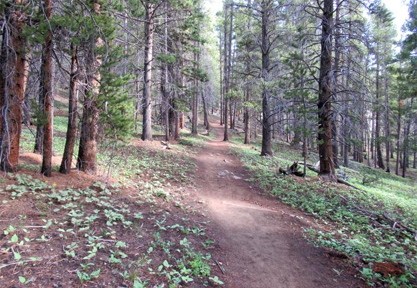
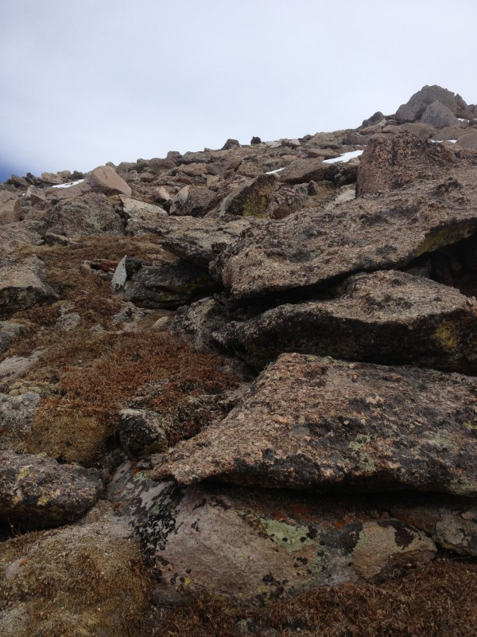
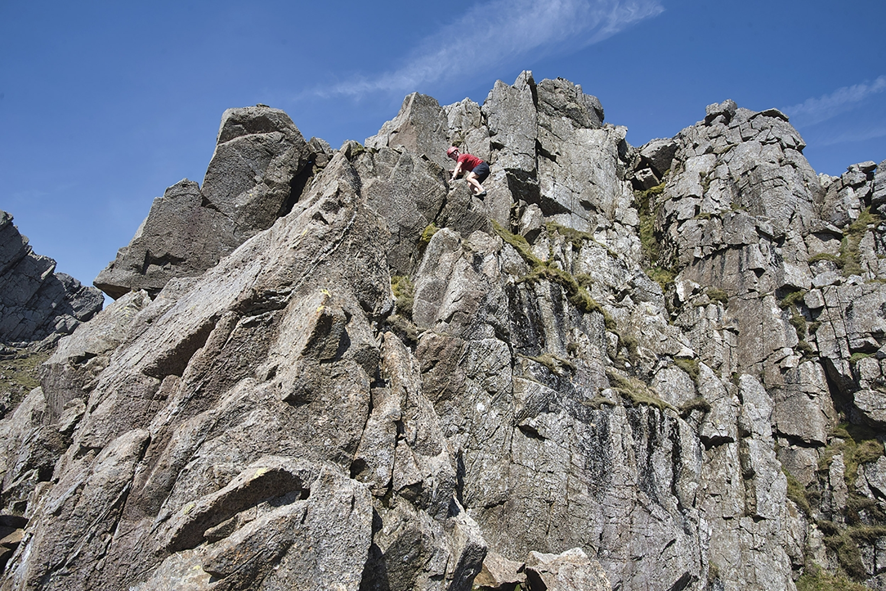
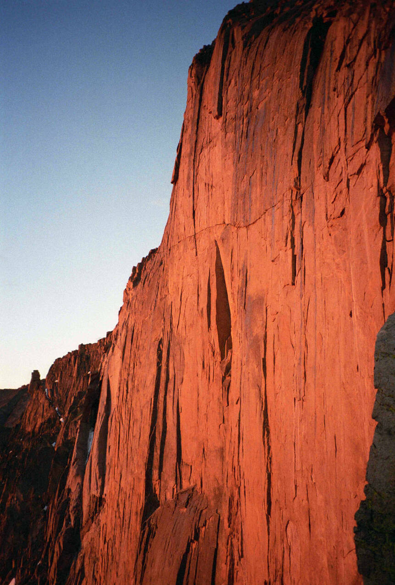

This file documents the process I took for developing the ML side of this plugin. The dataset I curated and models I used are discussed.

## ML Problem Description

The ML problem I try to solve is classification of a hiking or climbing route based on its [Yosemite Decimal System (YDS)](https://www.google.com/url?sa=t&rct=j&q=&esrc=s&source=web&cd=&cad=rja&uact=8&ved=2ahUKEwjm2sy0gquAAxXIm4kEHfesCRwQFnoECA0QAQ&url=https%3A%2F%2Fen.wikipedia.org%2Fwiki%2FYosemite_Decimal_System&usg=AOvVaw1ySM5K7V4gt6cfVp3JA2vn&opi=89978449) rating. There are five classes[^1] in the dataset, ranging from class 1 (a maintained trail) to class 5 (a cliff requiring technical rock climbing). Well-known routes usually have a documented YDS rating, but most mountainous natural areas do not. Groups such as recreational hikers and Search and Rescue personnel might therefore find useful an ATAK tool that estimates the YDS difficulty for a prospective route they wish to take.

## Dataset

The most involved part of the ML component was developing a dataset. My original dataset consisted of 5 classes with 80 images each, for a total of 400 images. Below are example images for each class.

| Class 1 (maintained trail) | Class 2 (off-trail, gentle grades) | Class 3 (simple scrambling, hands and feet used) | Class 4 (steeper, more dangerous & exposed scrambling) | Class 5 (technical rock climbing)[^2] |
| ------ | ------ | ------ | ------ | ------ |
|    <br />    |    <br />    |    <br />    |    <br />    |     <br />     |

Eventually I simplified this problem to just using class 1 (trails) and class 5 (sheer technical rock) as the only two classes. The reasons for this are discussed below in [Project development and challenges.](#development-training-performance-and-results) For the 2-class dataset, I was able to collect many more images, since classes 1 and 5 are much better represented in online resources as well as my own data collected in the field. I was also able to record video in the field and gather footage online for the two classes, and extracted the frames from these videos and added them to the dataset. This allowed me to expand the dataset to 1900 samples for each class, which could be doubled or tripled in size with augmentation. The dataset is still on the smaller end, but is much more reasonable for learning. 

### Dataset Discussion

The 5-class dataset is quite small. There are several reasons for this:

- **Most hiking/climbing images found online are unusable.**
    For example, here is a single image that contains multiple classes:

    

    There is a maintained trail in this photo (class 1). But in the background, there are also difficult ridges (perhaps class 4) and sheer cliffs (class 5). In addition, there is a person in this image. Most of the photos I found were like this: they had multiple classes, people, or artificial objects (e.g. climbing ropes), and were thus unusable for the global-level image classification approach.

    This was not a prohibitive issue, because I was able to crop out sections that only contained one class from many images. (Lower resolution is not much of a problem here because the images are already downsampled before training.) However, this approach increased the amount of manual data cleaning needed and therefore had a limited impact on the size of the dataset.

- **There is no centralized source of images.** 
    No Kaggle-esque database exists for YDS route images. A few individual sites such as [14ers.com](https://www.14ers.com/) and [Mountain Project](https://www.mountainproject.com/) have many images of routes. However, many images are still not usable because of arrows annotated on the image indicating the route, or people/climbing gear occupying much of the image. For this reason, I used Google Images queries like "class 4 climbing route" and scrolled down to the very bottom of available results. 

- **Representation of classes in online data is very unbalanced.** 
    It's easiest to find class 1 (hiking trail) and class 5 (rock wall) images online, because many more people recreate on those classes and it's easy for a human to label the route. However, finding labeled class 2-4 images is much more difficult, because they are posted much less frequently and are inherently more difficult to label. I also was able to do my own data gathering "in the field" and contribute many of my own images from hikes I went on.

    After many hours of data gathering I was able to put together a dataset with only 80 images for each class for a total of 400 images. This is a very small dataset by image-based ML standards, and as I discuss below was insufficient for the task. My modified 2-class dataset used the most visually distinct and well-represented classes (1 and 5), allowing me to expand the dataset to a (still small) 300 images per class.

In addition, there are some particularities about YDS data that make this problem harder to solve:

- **Strong visual similarity across different classes.** 
    For classes 2, 3, and 4, routes consist of boulderfields or solid rock that have very similar physical and geometric features. In particular, features available to an ML algorithm may simply be too sparse to make a distinction between classes 3 and 4. Even humans who actually study and climb these routes with their entire body and all their senses occasionally disagree on whether this-or-that particular route or move is class 3 or 4. 

- **YDS definitions depend on features unavailable in images alone.** 
    The best way to differentiate otherwise visually similar routes is by their steepness, which increases going from class 2 to class 5. Slope angle / steepness is therefore a crucial feature for classification. However, there is no way to tell how steep a slope in a given image is from the image alone, or what the pitch orientation of the camera was when the image is taken. To capture this information, one would need pitch orientation of the lens in image metadata, which is not included in data from standard smartphone cameras or online images. 

    It is possible that information extracted from the ATAK application could serve as features to indicate slope angle. I discuss this further under Conclusions.

- **Data augmentation is inherently limited.** 
    Most image domains are amenable to significant data augmentation in order to increase the size and diversity of the dataset. However, learning from the YDS dataset is very sensitive to geometrical information. As discussed above, slope angle is an important feature for YDS classification. So for example, an image that is rotated or sheared may turn a steep class 4 route into a gentle class 2 route. This issue rules out most standard augmentation techniques, such as rotations, flips, and shears. 

    One helpful transformation I was able to use is shifting the brightness of the image within a certain range. This better captures the variety of real-world brightness and varying light conditions that would be encountered in the field.

Given the above challenges, as the project progressed I decided that solving the problem with reasonable performance and the limited data and features I had would not be possible. For that reason, I shifted to the 2-class dataset I describe above. This enabled me to mostly mitigate the difficulties I describe in this section. The visual difference between class 1 maintained trail images and class 5 sheer cliffs is very distinct, and reinforced by the greater amount of data I was able to gather. 

## Models

There are a few ways a problem like this could be approached that would influence model selection. For example, one could use image segmentation to isolate the route from the rest of the image (e.g. ignore sky). To account for the small size and limited nature of the dataset, and to reduce the complexity of the ML problem, I chose to approach this like a simple global image classification problem. Because this plugin is deployed on a mobile device and requires efficient inference performance, I originally chose [MobileNetV3](https://www.tensorflow.org/api_docs/python/tf/keras/applications/MobileNetV3Small) for the model architecture.

However, MobileNetV3 showed very poor performance on both the 5-class dataset and the larger 2-class dataset (see discussion below). For that reason, I created a model with a relatively simple CNN-type architecture, which I will call YDSNet. The model looks like this:


## Development, training, performance, and results

The scripts I used are available [here](https://github.com/Toyon/LearnATAK/tree/master/ml_training/yds_estimator_training/YDS_trainer.py). `YDS_trainer.py` includes model and data pipeline construction, training, and evaluation metrics. The evaluation metrics are calculated across a standard validation dataset not seen during training. 

I set up a typical pipeline of model creation, data preprocessing, train-test-validation split, and validation metrics. When I started out with MobileNetV3, I would only train for 10-20 epochs given that it was already pre-trained on Imagenet. However, I never got results that indicated the model was actually learning anything. Though training loss approached 0, validation loss was very unstable from epoch to epoch; accuracy on validation data fell to random-guessing levels. Here is an exemplary confusion matrix on the 5-class dataset:
```
[[19  0  0  6 24]
 [ 4  0  0  5 37]
 [ 8  0  0  4 29]
 [14  0  0  3 40]
 [12  0  0  4 31]]
```
For a long time I believed this performance was due to the dataset I used, and the difficulties with this problem that I described above. I knew extracting features from the 5-class dataset would be difficult, but I did not expect complete failure as my training and validation metrics were indicating. I did not expect that a state-of-the-art, pretrained image classification model would in itself perform so poorly, so I instead invested in improving the dataset and simplifying the problem. 

However, I grew more suspicious of the model when I saw no improvement whatsoever on the simplified, visually distinct, and reasonably-sized 2-class dataset. I created YDSNet as a sanity check for this, and immediately saw great performance using it. I am not sure what exactly went wrong with MobileNetV3, but I speculate that the architecture may be too complex for the problem. I originally thought that the Imagenet weights may not translate well to the specific features of YDS classification, but I get essentially the same results when using MobileNetV3 without pretrained weights. 

After moving on to YDSNet, I saw much better performance. However, it is still susceptible to the dataset challenges discussed above. Below is the confusion matrix for the best results I obtained on the 5-class dataset after 100 epochs. This was with an accuracy of 0.53. 
```
[[26  6  0  2  4]
 [ 2 20  6  4  0]
 [ 0  2 28  7  2]
 [ 3  4 19 10  6]
 [ 5  0 16  6 22]]
```
The confusion matrix indicates at least some learning, and the accuracy is much better than random guessing. However, this is still poor performance and I believe this is almost entirely due to the suboptimal nature of the dataset. Below are metrics for the best results on the much larger, 2-class dataset.
Confusion Matrix:
```
[[590   7]
 [  8 556]]
```
Accuracy: 0.9870801033591732

ROC AUC: 0.9990704111574421

These metrics indicate strong performance and help shed light on the problems I was seeing earlier. 

## Conclusions

This project was a great demonstration of the extra challenges that come with curating a brand-new dataset for a new problem. I would have liked to get great classification performance across all five classes. However, I think it is extremely unlikely that this is possible with the features I had from just images. The feature space is just too sparse.

I was happy to at least have demonstrated that an ML-based classification analysis of natural terrain images is possible with strong performance. I did have to simplify the problem, but it does at least show a proof-of-concept for the problem domain. Additional features not available in images alone would help improve performance on the 5-class problem. These features would have to be hand-gathered.

One could take this project in further directions. For example, the ATAK application supports topographical map data. Using the location of the user and the compass orientation of the camera, one could estimate the average slope angle of the pictured route by using the topography present in the frame of the image, and incorporate this as a feature. This would be key to distinguishing between classes 3 and 4 in particular. One could also add camera pitch angle metadata to photos taken of routes as a feature. Collecting these features for training would require manually gathering lots of data in the field, and because areas with classes 2-4 are often remote locations, would take significant time and effort. I estimate that this would be a very difficult dataset to put together from scratch, because of the physical and logistical effort needed to reach these locations and climb routes so that they could be hand-labeled correctly. The hope with a completed dataset and well-trained model would be to supply SAR and other personnel in high-stakes situations, as well as novice hikers, another source of data as they go on their own journeys in the mountains.

I enjoyed being able to gather my own data in the field on my hiking and scrambling outings in the mountains near where I live. This added an extra sense of accomplishment and investment in the project. The contribution to the dataset was limited since my time and stamina are also limited. That said, any extra excuse to get out in nature is a win in my book.

I developed some tips and tricks from my experience in the [ML Guide documentation](../../machine_learning/ml_guide/).

## Notes

[^1]: In mountaineering parlance routes are actually called "class 3", "class 5", etc; this is a different meaning than a "class" of data in ML. However, because mountaineering "class" and ML "class" refer to the same categories in my project, here I will use the word interchangeably.

[^2]: Class 5 routes break down further into several grades of difficulty, from 5.0 (an experienced climber will often be comfortable without protective gear) to 5.15 (only perhaps 1 or 2 of the best climbers in the world are capable of attempting or completing the route). Because the distinctions between these grades are often very subtle and controversial, and very unlikely to supply enough features for an ML model to learn, I group all these grades under one "Class 5" class.
