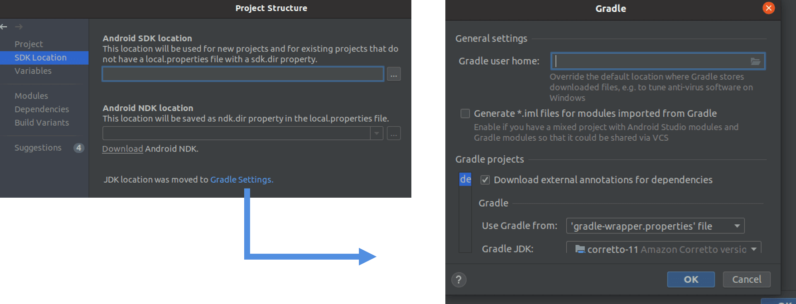
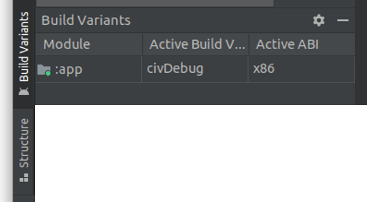

This document is the minimal set of steps required to run an already developed plugin from source code. 


2. Ensure your project's `local.properties` have the debug and release signing keys specified. If you experience a build error it is likely because you don't have these keys (copy the commands below to generate the keys), or your project is not in the correct folder. Ensure your root plugin folder is one directory below the SDK `main.jar`.

   ```sh
   # Run the following commands in your Android Studio Terminal
   # Generate Debug signing key: set "alias", "keypass", and "storepass" flag values as desired
   keytool -genkeypair -dname "CN=Android Debug,O=Android,C=US" -validity 9999 -keystore debug.keystore -alias androiddebugkey -keypass android -storepass android 
   
   # Generate Release signing key: set "alias", "keypass", and "storepass" flag values as desired
   keytool -genkeypair -dname "CN=Android Release,O=Android,C=US" -validity 9999 -keystore release.keystore -alias androidreleasekey -keypass android -storepass android 
   ```

   ```ini
   # the sdk.dir should be automatically assigned to the path of your Android Studio SDK 
   sdk.dir=<ANDROID_SDK_PATH>  
   takDebugKeyFile=<ABSOLUTE_PLUGIN_PATH>\\debug.keystore
   takDebugKeyFilePassword=android
   takDebugKeyAlias=androiddebugkey
   takDebugKeyPassword=android
   
   takReleaseKeyFile=<ABSOLUTE_PLUGIN_PATH>\\release.keystore
   takReleaseKeyFilePassword=android
   takReleaseKeyAlias=androidreleasekey
   takReleaseKeyPassword=android
   ```
   *Double check that your file paths are correct for each keystore or the build will fail*

3. In the upper left corner, go to `File > Project Structure` and click on the `SDK Location` tab. Click on the blue link to `Gradle Settings` and make sure the 
   `Gradle JDK` for java is Java version `11`. 

   
   

3. Build the application with the green hammer at the top.

   

   

5. Open the *Run Configurations* dropdown menu (next to build hammer) and select "Edit Configurations". Set the `Launch Options > Launch` dropdown selector to "Nothing" and press the *Apply* button.

   
   
5. Towards the bottom left, click on the `Build Variants` tab and change the `Active Build Variant` from `milDebug` to `civDebug`. 

   
      

6. Now you can run the plugin. 

------
